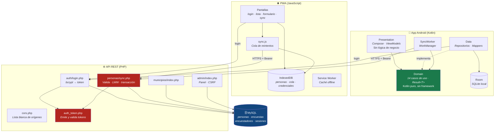
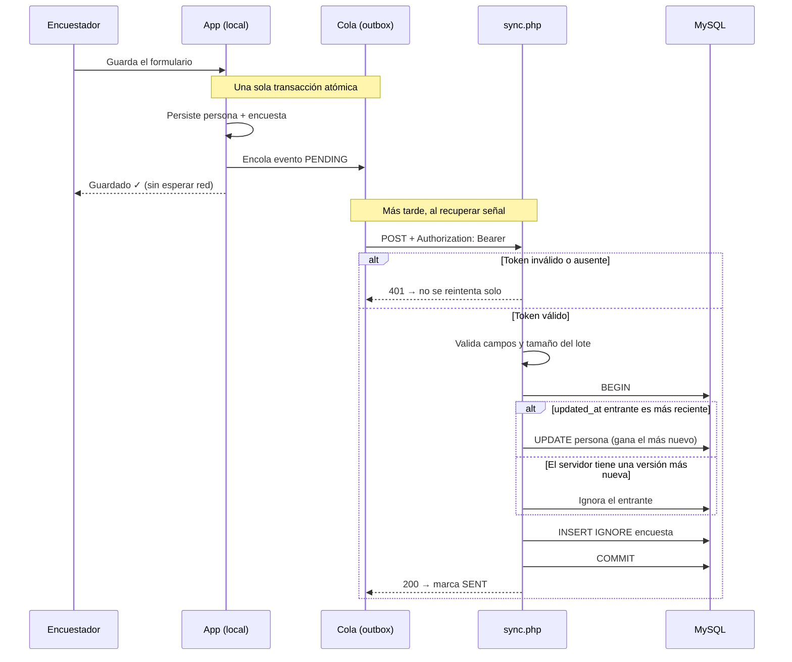

# Sistema de Encuestas - Offline First 📡

## Descripción
App Android nativa para el Ministerio de Salud, diseñada específicamente para funcionar en entornos rurales sin conectividad. Permite a los encuestadores recopilar y actualizar datos demográficos sin conexión a internet y sincronizarlos automáticamente mediante procesos en background cuando el dispositivo recupera la red.

## Objetivo
Garantizar la recolección íntegra de datos sobre el terreno y prevenir la pérdida o duplicación de información frente a concurrencia, resolviendo conflictos de manera autónoma.

## Arquitectura
El proyecto respeta rigurosamente **Clean Architecture**:
- **Presentation**: Jetpack Compose, ViewModels (StateFlow) e inyección con Hilt. No contiene lógica de negocio.
- **Domain**: Kotlin puro. Contiene los Casos de Uso (Use Cases), Modelos (Entities de negocio puras), abstracciones transaccionales y envolturas `Result<T>`. Totalmente agnóstico del framework.
- **Data**: Implementa los Repositorios de Dominio, manejando la persistencia local (Room) y la red (Retrofit). Utiliza Mappers para traducir hacia y desde el Dominio.

### Componentes y responsabilidades

Dos clientes independientes escriben contra la misma API. Cada uno tiene su propia base local y su propia cola, porque ambos deben funcionar sin conexión.



**Reglas que sostienen el diseño:**

| Componente | Responsabilidad | Qué NO hace |
|---|---|---|
| `Domain` (Android) | Reglas de negocio y validaciones | No conoce Room, Retrofit ni Android |
| `Data` (Android) | Persistencia y red; implementa las interfaces del dominio | No decide reglas de negocio |
| `SyncWorker` | Reintentos con backoff cuando hay red | No transforma datos |
| `auth_token.php` | Emitir y validar tokens | No autoriza por rol (no hay roles) |
| `sync.php` | Validar payload, resolver LWW, transacción atómica | No confía en el `id_encuestador` del cliente |
| Service Worker | Servir la app sin conexión | No cachea `/api/` |

### Flujo de una encuesta, de campo a servidor



El registro **nunca** queda solo en memoria: si la app muere entre el guardado y el envío, la cola sobrevive en disco y el `SyncWorker` la retoma.

### Decisiones de escalabilidad

| Decisión | Motivo |
|---|---|
| La sincronización viaja en **lotes de 100** | Antes Android enviaba una petición HTTP por registro. Volver del campo con 200 encuestas eran 200 viajes de ida y vuelta sobre una conexión intermitente. El servidor admite 500 por lote; 100 abarata el reintento y acota la memoria del JSON. |
| Solo se marca `SENT` lo que el servidor confirma | La respuesta trae `processed_encuestas`. Dar por bueno el envío completo hacía que un registro ignorado quedara marcado como sincronizado sin estarlo. |
| Las personas se **deduplican** dentro del lote | Crear y luego editar a la misma persona generaba dos copias idénticas en el payload. |
| Índice `(deleted_at, updated_at)` **solo en Room** | Es lo que consultan las dos listas del `PersonaDao`. En MySQL no se añade: el servidor accede a `personas` únicamente por clave primaria, así que allí no aportaría nada. |
| La lista de la PWA se pinta **de a 50** | Construir el HTML de miles de registros de golpe bloquea la interfaz en gama baja. Se amplía con `IntersectionObserver` al acercarse al final. |
| Eventos de la lista **por delegación** | Dos listeners en total en vez de dos por tarjeta. |

## Sistema de diseño

Una sola paleta institucional para las dos plataformas, declarada en dos sitios que deben mantenerse en espejo:

| Plataforma | Archivo |
|---|---|
| PWA | [`pwa/css/base.css`](pwa/css/base.css) — custom properties `--primary`, `--surface`, … |
| Android | [`presentation/theme/Theme.kt`](app/src/main/java/com/minsalud/encuestas/presentation/theme/Theme.kt) — `BrandPrimary`, `StatusSuccess`, … |

Los nombres describen el **rol, no el color**. La versión anterior los llamaba `BrandGreen`; cuando la marca pasó a azul, cada pantalla que los importaba quedó mintiendo. Si cambia la marca, se tocan esos dos archivos y nada más.

Todas las combinaciones de texto sobre fondo se verificaron por encima del mínimo **AA (4.5:1)** de WCAG.

## Tecnologías Utilizadas (App Android)
- **Kotlin & Coroutines/Flow**: Asincronía y reactividad.
- **Jetpack Compose**: UI declarativa (Material Design 3).
- **Navigation Compose**: Enrutamiento sin Fragments.
- **Room Database**: Persistencia SQLite local sin destrucciones no controladas.
- **Retrofit & OkHttp**: Consumo de API REST.
- **Dagger Hilt**: Inyección de dependencias estricta.
- **WorkManager**: Background processing para sincronización transparente.

## Algoritmo Offline-First y Last-Write-Wins (LWW)
Todo registro generado offline asume validez local y se empaqueta en la **Cola de Sincronización**.
El algoritmo **Last-Write-Wins** está soportado por un timestamp universal (`updatedAt`). Si dos encuestadores alteran al mismo ciudadano, el backend utiliza el valor de `updatedAt` para determinar de forma determinista y consistente cuál versión del dato sobreescribe a la otra.

## Patrón Outbox
Para garantizar que nunca se pierdan transacciones de red frente a fallas de energía o cierres de app:
1. El usuario guarda un formulario.
2. Una única transacción de negocio atómica almacena la Entidad Local y simultáneamente introduce un evento PENDING en la `cola_sincronizacion`.
3. El `SyncWorker` lee la cola y negocia con el backend en ciclos de backoff exponencial hasta asegurar la entrega (marcando como SENT).

## Tecnologías del Backend
- **PHP Puro**: API REST minimalista y directa.
- **MySQL**: Motor de bases de datos central. Resolutor de conflictos Last-Write-Wins a través de queries y transacciones ACID.

## Seguridad

### Autenticación por token
Los endpoints que **escriben** en la base de datos exigen un token. El flujo es:

1. `POST /api/auth/login.php` valida las credenciales con `password_verify` (bcrypt) y emite un token opaco de 32 bytes con 30 días de vigencia.
2. En la tabla `sesiones` solo se guarda el **hash SHA-256** del token: una filtración de la base de datos no permite suplantar a ningún encuestador.
3. `POST /api/personas/sync.php` exige la cabecera `Authorization: Bearer <token>` y atribuye las encuestas al encuestador del token, no al `id_encuestador` que envíe el cliente.

La vigencia es larga a propósito: el token se emite con conectividad y viaja con el dispositivo a terreno. Tanto la PWA (IndexedDB) como la app Android (SharedPreferences) lo conservan para que un inicio de sesión sin red pueda seguir sincronizando cuando vuelva la señal. **El primer inicio de sesión de cada dispositivo debe hacerse con conexión.**

### CORS
No se usa `Access-Control-Allow-Origin: *`. `api/cors.php` centraliza la política y solo refleja orígenes presentes en la variable de entorno `ALLOWED_ORIGINS`:

```
ALLOWED_ORIGINS=https://encuestas.manuelcardenas.online,http://localhost:8898
```

> CORS es una política del navegador y **no sustituye a la autenticación**: clientes como `curl` o la app Android la ignoran. La protección real de los endpoints es el token.

### Límite de intentos de inicio de sesión
`api/rate_limit.php` bloquea un documento durante **15 minutos tras 5 intentos fallidos**, y responde `429` con cabecera `Retry-After`. Un inicio de sesión correcto borra el historial.

Se cuenta **por documento, no por IP**, y es deliberado: la aplicación corre detrás de un proxy inverso, así que `REMOTE_ADDR` es la IP del proxy y es la misma para todos. Limitar por ella bloquearía a todos los encuestadores a la vez — una denegación de servicio autoinfligida. Confiar en `X-Forwarded-For` tampoco sirve sin conocer la configuración exacta del proxy, porque un cliente puede falsificarla.

Contar por documento protege lo que de verdad importa: adivinar la contraseña de una cuenta concreta. Un atacante puede rotar documentos para esquivarlo, pero entonces ya no está atacando a nadie en particular.

Los intentos se registran **exista o no el documento**, para que el bloqueo no delate qué cuentas son reales.

> La tabla `intentos_login` se crea sola la primera vez que se necesita, porque el despliegue de producción no tiene acceso SSH. `database/migrations/004_intentos_login.sql` deja el esquema versionado por si se prefiere crearla por adelantado.

### Política de contraseñas
El panel `/api/admin` exige **mínimo 10 caracteres** al crear una cuenta o cambiar su contraseña. La regla se aplica solo al fijarla, de modo que las cuentas existentes no quedan bloqueadas retroactivamente.

### Otras medidas
- Consultas con **PDO preparado** y `EMULATE_PREPARES => false`.
- Los mensajes de excepción van al log del servidor, nunca al cliente.
- El payload de sincronización se valida y normaliza campo por campo antes de abrir la transacción, con un tope de 500 registros por lote.
- El panel `/api/admin` usa token **CSRF** y contraseña por variable de entorno.
- En builds de release no se registran los cuerpos HTTP y la cabecera `Authorization` va redactada.

## Variables de Entorno
Copiar `.env.example` a `.env` y completar:

| Variable | Descripción |
|---|---|
| `DB_PASS` | Contraseña del usuario de la base de datos |
| `MYSQL_ROOT_PASS` | Contraseña root de MySQL |
| `ADMIN_PASSWORD` | Acceso al panel `/api/admin` |
| `ALLOWED_ORIGINS` | Orígenes autorizados para CORS, separados por comas y sin barra final |

## Pruebas
```bash
./gradlew testDebugUnitTest       # 38 pruebas unitarias JVM
node scripts/check-pwa-assets.mjs # integridad del caché offline de la PWA
```

Las pruebas cubren autenticación (`AuthRepositoryImplTest`), sincronización por lotes (`SyncRepositoryImplTest`), reglas de negocio y persistencia (`GuardarRegistroCompletoUseCaseTest`, `EliminarPersonaUseCaseTest`), validaciones (`GuardarPersonaUseCaseTest`, `RegistrarEncuestaUseCaseTest`) y manejo de errores (`SincronizarPendientesUseCaseTest`).

`check-pwa-assets.mjs` verifica que todo archivo listado en `pwa/sw.js` exista y que los recursos de `index.html` estén cacheados. Sin esa comprobación, dividir o renombrar un archivo rompe la app **sin conexión** — un fallo invisible al probar en línea.

## Estilos de la PWA

`styles.css` tenía 791 líneas. Se dividió en siete hojas por responsabilidad:

| Archivo | Líneas | Contenido |
|---|---:|---|
| `base.css` | 56 | Tokens de diseño, reset, contenedor |
| `layout.css` | 86 | Cabecera, contenido, navegación inferior |
| `components.css` | 109 | Búsqueda, tarjetas, insignias, FAB, estado vacío |
| `forms.css` | 106 | Pantalla de formulario y botones |
| `sync.css` | 55 | Pantalla de sincronización |
| `feedback.css` | 40 | Toasts, errores, visibilidad del chrome |
| `login.css` | 339 | Pantalla de inicio de sesión |

⚠️ **El orden de los `<link>` en `index.html` es significativo.** Cuando dos reglas tienen la misma especificidad gana la última, así que los archivos se cortaron en rangos contiguos y concatenarlos en ese orden reproduce el `styles.css` original byte a byte. Reordenar los `<link>` cambia la apariencia.

Al tocar cualquier hoja hay que **subir la versión de `CACHE` en `pwa/sw.js`**: el `fetch` es cache-first y sin ese cambio los navegadores seguirían sirviendo la versión anterior.

## Integración Continua
`.github/workflows/ci.yml` se ejecuta en cada push y pull request a `main`:

- **android**: pruebas unitarias + `assembleDebug` sobre JDK 17, publicando el reporte de pruebas.
- **php**: valida la sintaxis de todos los archivos de `api/` y falla si reaparece un CORS permisivo o si `sync.php` deja de exigir autenticación.
- **pwa**: verifica la integridad del caché offline.

## Estructura del Proyecto
```
proyecto_offline/
├── app/                  # Aplicación Android Nativa
│   ├── src/main/java/... # Clean Architecture (data, domain, presentation, di, worker)
│   └── src/test/java/... # Pruebas unitarias JVM
├── api/                  # Backend PHP (API REST)
│   ├── cors.php          # Política CORS centralizada (lista blanca)
│   └── auth_token.php    # Emisión y validación de tokens
├── pwa/                  # Progressive Web App (offline-first)
│   ├── css/              # 7 hojas por responsabilidad (ver nota abajo)
│   ├── js/screens/       # Una pantalla por archivo
│   └── sw.js             # Service worker: caché offline
├── database/             # Scripts SQL (esquema y migraciones)
├── scripts/              # Verificaciones usadas por CI
├── .github/workflows/    # Integración continua
└── README.md
```

## Instrucciones de Compilación
1. Abrir la carpeta raíz con **Android Studio** (Koala o superior recomendado).
2. Sincronizar Gradle usando el wrapper embebido (`./gradlew assembleDebug`).
3. **JDK 17**: AGP 8.2 lo requiere. El proyecto declara un *toolchain* de Java 17, así que Gradle lo descarga automáticamente aunque el equipo tenga otra versión instalada (con JDK 21 y sin toolchain, la compilación falla en `JdkImageTransform`).
4. Para el Backend: Levantar Apache/MySQL mediante XAMPP u otro stack LAMP apuntando a la carpeta `/api`.

### Base de datos ya desplegada
Las instalaciones nuevas obtienen todo desde `database/schema.sql`, que solo se ejecuta al crear una base vacía. Para una base existente hay que aplicar las migraciones pendientes una sola vez.

**Con acceso a la base de datos:**
```bash
docker exec -i encuestas_offline_db mysql -u root -p minsalud_encuestas < database/migrations/003_sesiones.sql
```

**Sin acceso SSH (despliegue por Dokploy):** abrir `https://TU_DOMINIO/api/setup/migrate.php` en el navegador e ingresar la contraseña de `ADMIN_PASSWORD` en el formulario. El endpoint es idempotente y aplica las migraciones 002 y 003 más la cuenta de prueba.

> El SQL va embebido en `migrate.php` porque `.dockerignore` excluye `database/` de la imagen — si no lo hiciera, los `.sql` quedarían descargables por HTTP desde el docroot.
>
> **Borrar `api/setup/migrate.php` y volver a desplegar** una vez aplicada la migración. Es un endpoint administrativo; no debe quedar expuesto de forma permanente.

## Estado Actual del Proyecto
- **Android**: Scaffolding, Data, Domain, UseCases, Repositorios, ViewModels, UI Compose, WorkManager Sync completados.
- **Backend/DB**: Completados Scripts DDL y Endpoints de resolución de conflictos.
- **Calidad**: 38 pruebas unitarias, integración continua en GitHub Actions y autenticación por token en los endpoints de escritura.

## Licencia
Distribuido bajo licencia MIT. Ver [LICENSE](LICENSE).
