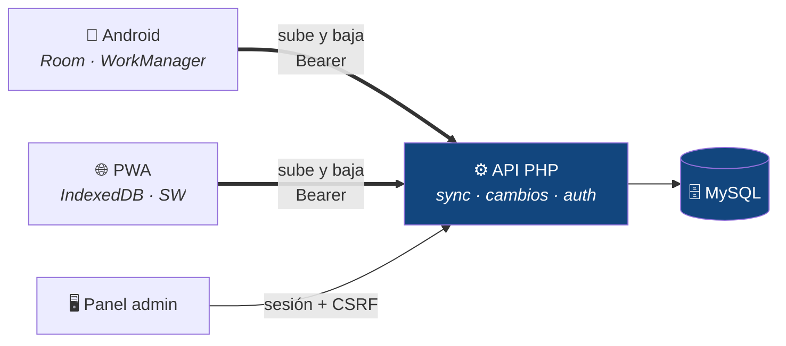
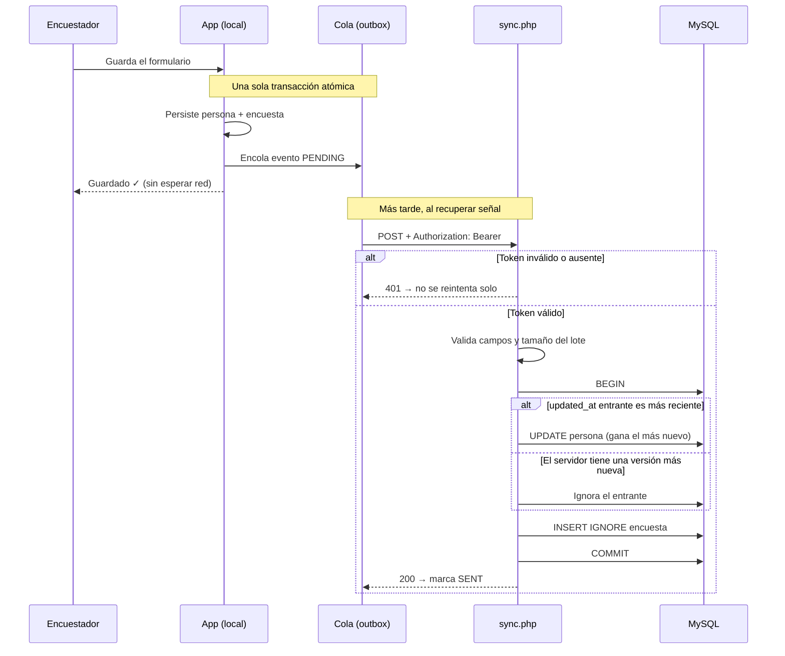

# Sistema de Encuestas - Offline First 📡

Sistema de recolección de datos demográficos para el Ministerio de Salud, diseñado para funcionar en zonas rurales **sin conectividad**. Compuesto por una **app Android nativa**, una **PWA**, una **API REST en PHP** y un **panel de administración web**.

🔗 **Producción:** app de encuestas en https://encuestas.manuelcardenas.online/pwa/ · panel en https://encuestas.manuelcardenas.online/api/admin/

<p align="center">
  
  &nbsp;
  
</p>

## 📚 Documentación

| Documento | Contenido |
|---|---|
| [**Manual de uso**](docs/MANUAL.md) | Guía para encuestadores y administradores, con capturas |
| [**Arquitectura**](docs/ARQUITECTURA.md) | Diagramas de componentes, despliegue, modelo de datos y flujos (registro, sincronización, validación, diseño) · 11 decisiones de arquitectura |
| [**Historias de usuario**](docs/HISTORIAS-DE-USUARIO.md) | 35 historias con criterios de aceptación y trazabilidad a código y pruebas |
| [**API**](docs/API.md) | Endpoints, parámetros, respuestas, reglas de validación y ejemplos |
| [**Pruebas**](docs/PRUEBAS.md) | Inventario de las 254 pruebas automáticas y cómo correrlas |
| [**Pruebas de campo**](docs/PRUEBAS-DE-CAMPO.md) | Lista de verificación en celulares reales |
| [**Pendientes**](docs/PENDIENTES.md) | Qué falta, por qué, y qué pasa si no se hace |

## Descripción
App Android nativa para el Ministerio de Salud, diseñada específicamente para funcionar en entornos rurales sin conectividad. Permite a los encuestadores recopilar y actualizar datos demográficos sin conexión a internet y sincronizarlos automáticamente mediante procesos en background cuando el dispositivo recupera la red.

## Objetivo
Garantizar la recolección íntegra de datos sobre el terreno y prevenir la pérdida o duplicación de información frente a concurrencia, resolviendo conflictos de manera autónoma.

## De un vistazo

| | |
|---|---|
| **Clientes** | Android nativo (Kotlin · Compose · Room) · PWA (JavaScript sin framework · IndexedDB) |
| **Backend** | PHP 8 sin framework · MySQL 8.4 |
| **Sincronización** | Bidireccional, por lotes, con Outbox y Last-Write-Wins |
| **Validación** | Las mismas reglas por campo en los dos clientes y el servidor, con filtro al escribir |
| **Catálogos** | Los 1.122 municipios del DANE y las EPS de Colombia, con buscador; viajan dentro de la app |
| **Diseño** | «Cálida de territorio»: una paleta (`design/tokens.json`) y la fuente Figtree empaquetada en las tres superficies |
| **Pruebas** | 254 automatizadas — 85 Android · 72 PWA · 90 API y panel · 7 de punta a punta en navegador real |
| **CI** | 4 trabajos · PHPStan nivel 8 · Android Lint · guardas de regresión |
| **Despliegue** | Dokploy sobre Docker Swarm · TLS con acme.sh |

## Arquitectura
El proyecto respeta rigurosamente **Clean Architecture**:
- **Presentation**: Jetpack Compose, ViewModels (StateFlow) e inyección con Hilt. No contiene lógica de negocio.
- **Domain**: Kotlin puro. Contiene los Casos de Uso (Use Cases), Modelos (Entities de negocio puras), abstracciones transaccionales y envolturas `Result<T>`. Totalmente agnóstico del framework.
- **Data**: Implementa los Repositorios de Dominio, manejando la persistencia local (Room) y la red (Retrofit). Utiliza Mappers para traducir hacia y desde el Dominio.

### Componentes y responsabilidades

Dos clientes independientes escriben contra la misma API. Cada uno tiene su propia base local y su propia cola, porque ambos deben funcionar sin conexión.


```mermaid
graph LR
    AND["📱 Android<br/><i>Room · WorkManager</i>"]
    PWA["🌐 PWA<br/><i>IndexedDB · SW</i>"]
    API["⚙️ API PHP<br/><i>sync · cambios · auth</i>"]
    DB[("🗄️ MySQL")]
    ADM["🖥️ Panel admin"]

    AND ==>|"sube y baja<br/>Bearer"| API
    PWA ==>|"sube y baja<br/>Bearer"| API
    API --> DB
    ADM -->|"sesión + CSRF"| API

    style API fill:#12467E,color:#fff
    style DB fill:#12467E,color:#fff
```

> **[Ver el diagrama de componentes completo →](docs/ARQUITECTURA.md#2-diagrama-de-componentes)** con las capas internas de cada cliente, el diagrama de despliegue y el modelo entidad-relación.

**Reglas que sostienen el diseño:**

| Componente | Responsabilidad | Qué NO hace |
|---|---|---|
| `Domain` (Android) | Reglas de negocio y validaciones | No conoce Room, Retrofit ni Android |
| `Data` (Android) | Persistencia y red; implementa las interfaces del dominio | No decide reglas de negocio |
| `SyncWorker` | Reintentos con backoff cuando hay red | No transforma datos |
| `auth_token.php` | Emitir y validar tokens; resolver el rol | No decide qué puede hacer cada rol |
| `sync.php` | Validar payload, resolver LWW, transacción atómica | No confía en el `id_encuestador` del cliente |
| Service Worker | Servir la app sin conexión | No cachea `/api/` |

### Flujo de una encuesta, de campo a servidor


```mermaid
sequenceDiagram
    participant U as Encuestador
    participant A as App (local)
    participant C as Cola (outbox)
    participant S as sync.php
    participant D as MySQL

    U->>A: Guarda el formulario
    Note over A,C: Una sola transacción atómica
    A->>A: Persiste persona + encuesta
    A->>C: Encola evento PENDING
    A-->>U: Guardado ✓ (sin esperar red)

    Note over C,S: Más tarde, al recuperar señal
    C->>S: POST + Authorization: Bearer
    alt Token inválido o ausente
        S-->>C: 401 → no se reintenta solo
    else Token válido
        S->>S: Valida campos y tamaño del lote
        S->>D: BEGIN
        alt updated_at entrante es más reciente
            S->>D: UPDATE persona (gana el más nuevo)
        else El servidor tiene una versión más nueva
            S->>D: Ignora el entrante
        end
        S->>D: INSERT IGNORE encuesta
        S->>D: COMMIT
        S-->>C: 200 → marca SENT
    end
```

El registro **nunca** queda solo en memoria: si la app muere entre el guardado y el envío, la cola sobrevive en disco y el `SyncWorker` la retoma.

### Sincronización en los dos sentidos

La sincronización **sube y baja**. Primero envía lo pendiente y después descarga lo que registraron otros dispositivos; en ese orden, porque subiendo antes el servidor ya conoce los cambios locales cuando se le pregunta, y se evita un conflicto que no hacía falta tener.

| Pieza | Función |
|---|---|
| `updated_at` | Lo pone el **dispositivo**. Resuelve conflictos por Last-Write-Wins. |
| `server_updated_at` | Lo pone el **servidor**. Es la marca de agua de la descarga incremental. |

Son dos campos y no uno por un motivo concreto: si la descarga preguntara "dame lo cambiado desde X" usando `updated_at`, un teléfono con el reloj atrasado escribiría filas con fecha vieja que los demás dispositivos ya habrían superado. **Esos registros no se descargarían nunca y el dato se perdería en silencio.** El sello del servidor avanza siempre hacia adelante, sin depender del reloj de nadie.

Al mezclar lo descargado, **los cambios locales sin enviar nunca se pisan**: todavía no llegaron al servidor, así que lo que vuelve es por fuerza anterior. Sobrescribirlos borraría una encuesta recién hecha.

### Decisiones de escalabilidad

| Decisión | Motivo |
|---|---|
| La sincronización viaja en **lotes de 100** | Antes Android enviaba una petición HTTP por registro. Volver del campo con 200 encuestas eran 200 viajes de ida y vuelta sobre una conexión intermitente. El servidor admite 500 por lote; 100 abarata el reintento y acota la memoria del JSON. |
| Solo se marca `SENT` lo que el servidor confirma | La respuesta trae `processed_encuestas`. Dar por bueno el envío completo hacía que un registro ignorado quedara marcado como sincronizado sin estarlo. |
| Las personas se **deduplican** dentro del lote | Crear y luego editar a la misma persona generaba dos copias idénticas en el payload. |
| Índice `(deleted_at, updated_at)` **solo en Room** | Es lo que consultan las dos listas del `PersonaDao`. En MySQL no se añade: el servidor accede a `personas` únicamente por clave primaria, así que allí no aportaría nada. |
| La lista de la PWA se pinta **de a 50** | Construir el HTML de miles de registros de golpe bloquea la interfaz en gama baja. Se amplía con `IntersectionObserver` al acercarse al final. |
| Eventos de la lista **por delegación** | Dos listeners en total en vez de dos por tarjeta. |

## Validación de los datos

Lo que el servidor rechazaría no se puede guardar en el teléfono, porque cuando llega el rechazo el encuestador ya no está frente a la persona. Por eso hay tres capas con **las mismas reglas**:

1. **Al escribir:** lo que no corresponde al campo no entra (letras en el documento o el teléfono, números en el nombre, más caracteres que el máximo). El teclado cambia según el tipo de documento.
2. **Al guardar:** cada campo con error se marca con su motivo y no se guarda nada.
3. **En el servidor:** se valida todo otra vez; una fila inválida se rechaza con su motivo sin tumbar el lote.

| Campo | Regla |
|---|---|
| Documento | Solo dígitos según el tipo: CC 6–10 · TI y RC 10–11 · CE 6–10 · NIT 9–10 · PE 6–15. Solo el pasaporte (PP, 6–12) admite letras |
| Nombres y apellidos | Obligatorios, 2 a 60: letras (con tildes y ñ), espacios, guion o apóstrofo |
| Teléfono | 10 dígitos: celular `3…` o fijo `60…` |
| Fecha de nacimiento | Entre 1900 y hoy |
| Dirección · vereda · EPS · ocupación | Largo mínimo y máximo, caracteres permitidos y al menos una letra |
| Estrato · correo · municipio | 1 a 6 · formato válido · debe existir en el catálogo |

Las reglas viven en [`pwa/js/validacion.js`](pwa/js/validacion.js), [`Validaciones.kt`](app/src/main/java/com/minsalud/encuestas/domain/validation/Validaciones.kt) y [`api/personas/validacion.php`](api/personas/validacion.php). [`pwa/tests/paridad.test.mjs`](pwa/tests/paridad.test.mjs) lee las tres y falla si alguna diverge.

## Sistema de diseño

Dirección **«Cálida de territorio»**: azul institucional `#12467E`, fondo cálido `#F6F4EF`, tarjetas blancas con esquinas generosas y un acento terracota `#B4532A` reservado para la acción de registrar y el día de hoy en los gráficos. Tipografía **Figtree**, empaquetada (no se descarga de Google Fonts: la app se ve igual sin señal y no se filtra la IP de nadie).

La paleta tiene **una sola fuente**, [`design/tokens.json`](design/tokens.json), y `node scripts/tokens.mjs` la escribe en las tres superficies:

| Superficie | Archivo |
|---|---|
| PWA | [`pwa/css/base.css`](pwa/css/base.css) — `--primary`, `--accent`, `--surface`, … (con modo oscuro) |
| Panel | [`api/admin/admin.css`](api/admin/admin.css) — `--primary`, `--acento`, … |
| Android | [`presentation/theme/Theme.kt`](app/src/main/java/com/minsalud/encuestas/presentation/theme/Theme.kt) — `BrandPrimary`, `BrandAccent`, … más tipografía y formas |

CI falla si alguno de los tres se edita a mano y deja de coincidir. Los nombres describen el **rol, no el color**: la versión anterior los llamaba `BrandGreen` y, cuando la marca pasó a azul, cada pantalla que los importaba quedó mintiendo.

Todas las combinaciones de texto sobre fondo cumplen **WCAG AA** en modo claro y oscuro, y lo verifica una prueba ([`contraste.test.mjs`](pwa/tests/contraste.test.mjs)). El estado de cada registro lleva siempre icono y palabra: el color nunca es la única señal.

## Tecnologías Utilizadas (App Android)
- **Kotlin & Coroutines/Flow**: Asincronía y reactividad.
- **Jetpack Compose**: UI declarativa (Material Design 3).
- **Navigation Compose**: Enrutamiento sin Fragments.
- **Room Database**: Persistencia SQLite local sin destrucciones no controladas.
- **Retrofit & OkHttp**: Consumo de API REST.
- **Dagger Hilt**: Inyección de dependencias estricta.
- **WorkManager**: Background processing para sincronización transparente.

## Algoritmo Offline-First y Last-Write-Wins (LWW)
Todo registro generado offline asume validez local y se empaqueta en la **Cola de Sincronización**.
El algoritmo **Last-Write-Wins** está soportado por un timestamp universal (`updatedAt`). Si dos encuestadores alteran al mismo ciudadano, el backend utiliza el valor de `updatedAt` para determinar de forma determinista y consistente cuál versión del dato sobreescribe a la otra.

## Patrón Outbox
Para garantizar que nunca se pierdan transacciones de red frente a fallas de energía o cierres de app:
1. El usuario guarda un formulario.
2. Una única transacción de negocio atómica almacena la Entidad Local y simultáneamente introduce un evento PENDING en la `cola_sincronizacion`.
3. El `SyncWorker` lee la cola y negocia con el backend en ciclos de backoff exponencial hasta asegurar la entrega (marcando como SENT).

## Tecnologías del Backend
- **PHP Puro**: API REST minimalista y directa.
- **MySQL**: Motor de bases de datos central. Resolutor de conflictos Last-Write-Wins a través de queries y transacciones ACID.

## Seguridad

### Autenticación por token
Los endpoints que **escriben** en la base de datos exigen un token. El flujo es:

1. `POST /api/auth/login.php` valida las credenciales con `password_verify` (bcrypt) y emite un token opaco de 32 bytes con 30 días de vigencia.
2. En la tabla `sesiones` solo se guarda el **hash SHA-256** del token: una filtración de la base de datos no permite suplantar a ningún encuestador.
3. `POST /api/personas/sync.php` exige la cabecera `Authorization: Bearer <token>` y atribuye las encuestas al encuestador del token, no al `id_encuestador` que envíe el cliente.

La vigencia es larga a propósito: el token se emite con conectividad y viaja con el dispositivo a terreno. Tanto la PWA (IndexedDB) como la app Android (SharedPreferences) lo conservan para que un inicio de sesión sin red pueda seguir sincronizando cuando vuelva la señal. **El primer inicio de sesión de cada dispositivo debe hacerse con conexión.**

### CORS
No se usa `Access-Control-Allow-Origin: *`. `api/cors.php` centraliza la política y solo refleja orígenes presentes en la variable de entorno `ALLOWED_ORIGINS`:

```
ALLOWED_ORIGINS=https://encuestas.manuelcardenas.online,http://localhost:8898
```

> CORS es una política del navegador y **no sustituye a la autenticación**: clientes como `curl` o la app Android la ignoran. La protección real de los endpoints es el token.

### Límite de intentos de inicio de sesión
`api/rate_limit.php` bloquea un documento durante **15 minutos tras 5 intentos fallidos**, y responde `429` con cabecera `Retry-After`. Un inicio de sesión correcto borra el historial.

Se cuenta **por documento, no por IP**, y es deliberado: la aplicación corre detrás de un proxy inverso, así que `REMOTE_ADDR` es la IP del proxy y es la misma para todos. Limitar por ella bloquearía a todos los encuestadores a la vez — una denegación de servicio autoinfligida. Confiar en `X-Forwarded-For` tampoco sirve sin conocer la configuración exacta del proxy, porque un cliente puede falsificarla.

Contar por documento protege lo que de verdad importa: adivinar la contraseña de una cuenta concreta. Un atacante puede rotar documentos para esquivarlo, pero entonces ya no está atacando a nadie en particular.

Los intentos se registran **exista o no el documento**, para que el bloqueo no delate qué cuentas son reales.

> La tabla `intentos_login` se crea sola la primera vez que se necesita, porque el despliegue de producción no tiene acceso SSH. `database/migrations/004_intentos_login.sql` deja el esquema versionado por si se prefiere crearla por adelantado.

El **panel de administración** aplica el mismo límite. Estando bloqueado, incluso la contraseña correcta se rechaza: el corte ocurre antes de compararla, o el límite sería decorativo.

> El contador del panel se guarda bajo la clave `#admin`, imposible de producir desde fuera porque `login.php` solo admite documentos con `[A-Za-z0-9-]`. Las dos cosas van juntas: si se relaja esa validación, un cliente podría bloquear el panel sin tocarlo. Hay una guarda de CI que lo impide.

### Política de contraseñas
El panel `/api/admin` exige **mínimo 10 caracteres** al crear una cuenta o cambiar su contraseña. La regla se aplica solo al fijarla, de modo que las cuentas existentes no quedan bloqueadas retroactivamente.

### Otras medidas
- Consultas con **PDO preparado** y `EMULATE_PREPARES => false`.
- Los mensajes de excepción van al log del servidor, nunca al cliente.
- El payload de sincronización se valida y normaliza campo por campo antes de abrir la transacción, con un tope de 500 registros por lote.
- El panel `/api/admin` usa token **CSRF**, cookie `HttpOnly; SameSite=Strict; Secure` y regenera el identificador de sesión al autenticar (fijación de sesión).
- El panel autentica contra **cuentas con rol**, no contra una contraseña compartida: cada acción administrativa queda con autor. Ver [Roles](#roles).
- En builds de release no se registran los cuerpos HTTP y la cabecera `Authorization` va redactada.

## Variables de Entorno
Copiar `.env.example` a `.env` y completar:

| Variable | Descripción |
|---|---|
| `DB_PASS` | Contraseña del usuario de la base de datos |
| `MYSQL_ROOT_PASS` | Contraseña root de MySQL |
| `ADMIN_PASSWORD` | **Solo para el arranque.** Permite entrar al panel mientras no exista ninguna cuenta con rol `admin`, para poder crear la primera. En cuanto existe una, deja de aceptarse y la variable se puede borrar del entorno. |
| `ALLOWED_ORIGINS` | Orígenes autorizados para CORS, separados por comas y sin barra final |

## Pruebas

**254 pruebas automáticas, 0 fallos.** El inventario completo está en [docs/PRUEBAS.md](docs/PRUEBAS.md).

```bash
./gradlew testDebugUnitTest lintDebug assembleDebug   # 85 Android + lint + APK
TZ=America/Bogota node --test pwa/tests/*.test.mjs    # 72 PWA (catálogos, paridad, contraste, tildes)
vendor/bin/phpunit                                    # 90 API y panel, contra MySQL real
node --test tests/e2e/e2e.test.mjs                    # 7 de punta a punta en Chrome/Edge
vendor/bin/phpstan analyse                            # análisis estático, nivel 8
node scripts/check-pwa-assets.mjs                     # la caché offline está completa
node scripts/tokens.mjs --verificar                   # la paleta coincide en las tres superficies
node scripts/catalogos.mjs --verificar                # municipios y EPS iguales en PWA, Android y servidor
```

| Suite | Qué cubre |
|---|---|
| **Android** | Autenticación, sincronización por lotes, mezcla al descargar, guardado atómico con la cola, validaciones, estado de la interfaz |
| **PWA** | Fechas en dos husos horarios, sesión, cliente HTTP, mezcla, reparto tras un envío parcial, validación y filtro de campos, **paridad de reglas** con el servidor y Android, **contraste WCAG** |
| **API y panel** | Sincronización (token, cursor, Last-Write-Wins, rechazo por fila, reloj adelantado), descarga por municipios, panel completo (acceso, bloqueo, búsqueda, CSV, cuentas, auditoría, CSP) y cada regla de validación |
| **Punta a punta** | Un navegador real crea cuentas en el panel, entra a la app, registra **sin señal**, recupera la señal y comprueba que el registro llegó al panel |

Las pruebas de PHP y las de punta a punta crean y borran su propia base: nunca tocan la real. Las de fecha de la PWA se corren en `America/Bogota` y `Asia/Tokyo` porque el fallo que las motivó —la fecha de nacimiento corriéndose un día en cada edición— solo aparecía con desfase negativo respecto a UTC.

## Estilos de la PWA

Siete hojas por responsabilidad:

| Archivo | Líneas | Contenido |
|---|---:|---|
| `base.css` | 138 | Fuente, tokens de diseño (claro y oscuro), reset, contenedor |
| `layout.css` | 129 | Cabecera, contenido, barra inferior con el botón de registrar |
| `components.css` | 178 | Saludo, tarjeta del día, gráfico de la semana, búsqueda, tarjetas, estados, estado vacío |
| `forms.css` | 121 | Formulario, ayudas y errores por campo, botones |
| `sync.css` | 85 | Pantalla de envío de datos |
| `feedback.css` | 73 | Avisos flotantes, aviso de sesión vencida, visibilidad de la cabecera |
| `login.css` | 400 | Pantalla de inicio de sesión |

⚠️ **El orden de los `<link>` en `index.html` es significativo.** Cuando dos reglas tienen la misma especificidad gana la última; reordenarlos cambia la apariencia.

Al tocar cualquier hoja hay que **subir la versión de `CACHE` en `pwa/sw.js`**: el `fetch` es cache-first y sin ese cambio los navegadores seguirían sirviendo la versión anterior.

## Integración Continua
`.github/workflows/ci.yml` se ejecuta en cada push y pull request a `main`:

- **android**: pruebas unitarias, **Android Lint**, cobertura con **JaCoCo** y `assembleDebug` sobre JDK 17, publicando el reporte.
- **php**: sintaxis de todos los archivos de `api/`, **PHPStan nivel 8** y las pruebas de **PHPUnit contra MySQL 8.4**, más las guardas de abajo.
- **pwa**: pruebas con el runner de Node en dos husos horarios, integridad del caché offline y verificación de la paleta.
- **e2e**: el recorrido completo en **Chrome real**, contra una base desechable; publica las capturas como artefacto.

**Guardas de regresión.** CI no solo comprueba que las pruebas pasen: falla si vuelve a aparecer un fallo ya corregido. Cada una nació de un problema real.

| La compilación falla si… | Porque… |
|---|---|
| Reaparece `Access-Control-Allow-Origin: *` | Cualquier sitio podría llamar a la API desde el navegador |
| `sync.php` deja de exigir token | Cualquiera con `curl` podría insertar registros |
| `cambios.php` deja de exigir token | Expondría los datos de todos los dispositivos |
| La descarga filtra por `updated_at` | Las filas de un teléfono con el reloj atrasado no se descargarían nunca |
| `sync.php` deja de validar el documento | En producción llegó a colarse una persona con documento `"hola"` |
| Las validaciones vuelven a abortar el lote entero | Un registro irreparable bloqueaba la cola de un encuestador para siempre |
| El borrado de personas pasa a ser `DELETE` | Los dispositivos que ya la descargaron se la quedarían para siempre |
| Desaparece el límite de intentos del panel | La URL es pública y no pedía usuario |
| `login.php` deja de validar el formato del documento | Se podría bloquear el panel desde fuera |
| El panel deja de usar cuentas con rol | Ninguna acción administrativa tendría autor |
| Se puede quitar el rol al último administrador | Uno se dejaría fuera sin forma de volver a entrar |
| La paleta de la PWA, el panel o Android difiere de `design/tokens.json` | Las tres superficies divergían en silencio |
| Las reglas de validación difieren entre PWA, servidor y Android (prueba de paridad) | El teléfono guardaría datos que el servidor rechaza días después |

Además, **Dependabot** vigila las dependencias de Gradle, Composer y las acciones de GitHub.

## Estructura del Proyecto
```
proyecto_offline/
├── app/                  # Aplicación Android nativa
│   ├── src/main/java/... # Clean Architecture (data, domain, presentation, di, worker)
│   ├── src/main/res/font # Figtree
│   └── src/test/java/... # Pruebas unitarias JVM
├── api/                  # Backend PHP (API REST)
│   ├── admin/            # Panel de administración (vistas, estilos, SQL)
│   ├── personas/         # sync.php · cambios.php · validacion.php
│   ├── cors.php          # Política CORS centralizada (lista blanca)
│   └── auth_token.php    # Emisión y validación de tokens
├── pwa/                  # Progressive Web App (offline-first)
│   ├── css/ fonts/       # 7 hojas por responsabilidad · Figtree
│   ├── js/screens/       # Una pantalla por archivo
│   ├── tests/            # node --test
│   └── sw.js             # Service worker: caché offline
├── tests/
│   ├── php/              # PHPUnit: integración + unitarias
│   └── e2e/              # Punta a punta en navegador real
├── design/tokens.json    # Paleta: fuente única
├── database/catalogos/   # Municipios (DIVIPOLA) y EPS: fuente única
├── database/             # Esquema y migraciones
├── scripts/              # tokens.mjs · catalogos.mjs · check-pwa-assets.mjs
├── docs/                 # Documentación y capturas
├── .github/workflows/    # Integración continua
└── README.md
```

## Instrucciones de Compilación
1. Abrir la carpeta raíz con **Android Studio** (Koala o superior recomendado).
2. Sincronizar Gradle usando el wrapper embebido (`./gradlew assembleDebug`).
3. **JDK 17**: AGP 8.2 lo requiere. El proyecto declara un *toolchain* de Java 17, así que Gradle lo descarga automáticamente aunque el equipo tenga otra versión instalada (con JDK 21 y sin toolchain, la compilación falla en `JdkImageTransform`).
4. Para el Backend: Levantar Apache/MySQL mediante XAMPP u otro stack LAMP apuntando a la carpeta `/api`.

### Base de datos ya desplegada
Las instalaciones nuevas obtienen todo desde `database/schema.sql`, que solo se ejecuta al crear una base vacía. Para una base existente hay que aplicar las migraciones pendientes una sola vez.

**Con acceso a la base de datos:**
```bash
docker exec -i $(docker ps --format '{{.Names}}' | grep offlinedb) \
  mysql -u root -p minsalud_encuestas < database/migrations/003_sesiones.sql
```

> El nombre del contenedor se obtiene con `docker ps` porque Dokploy despliega sobre Docker Swarm y le añade un sufijo que **cambia en cada despliegue**. Los nombres fijos del `docker-compose.yml` de este repositorio no son los que corren en producción.

**Sin acceso SSH:** los cambios de esquema posteriores se aplican solos. `api/esquema.php` comprueba contra `information_schema` si falta una columna y la crea en la primera petición que la necesite (`server_updated_at` en `personas`, `rol` en `encuestadores`). No hay endpoint de migración que exponer ni que recordar borrar.

## Roles

La tabla `encuestadores` tiene una columna `rol` con dos valores:

| Rol | Qué puede hacer |
|---|---|
| `encuestador` | Iniciar sesión en la PWA y en la app de Android, registrar y sincronizar encuestas. Por defecto. |
| `admin` | Todo lo anterior, y además entrar al panel `/api/admin` con su documento y contraseña. |

El panel valida contra esta tabla, no contra una contraseña compartida, de modo que cada acción administrativa queda con autor: al borrar una persona, `device_id` guarda `admin:<nombre>`.

**Primera puesta en marcha:** define `ADMIN_PASSWORD`, entra al panel con ella, y crea desde *Cuentas* una cuenta con rol Administrador. Al guardarla se cierra la sesión, la contraseña compartida deja de aceptarse y ya puedes retirar la variable del entorno.

No es posible quitarse el rol ni desactivarse siendo el único administrador activo: el panel lo rechaza, porque recuperarse de eso exigiría entrar a la base de datos a mano.

## Estado actual del proyecto

*Al 9 de octubre de 2026, desplegado en producción.*

- **Clientes**: Android y PWA completos y offline-first, con validación estricta por campo y la dirección visual «Cálida de territorio».
- **Backend**: sincronización bidireccional por lotes, rechazo por fila, descarga limitada por municipios, automigración de esquema.
- **Panel**: resumen, personas (ficha, edición, filtros, CSV, papelera), cuentas, monitor de sincronización y auditoría; acceso rediseñado.
- **Calidad**: 254 pruebas automatizadas (85 Android, 72 PWA, 90 API y panel, 7 de punta a punta), PHPStan nivel 8, Android Lint, cobertura con JaCoCo, contraste WCAG AA verificado y guardas de regresión en CI.
- **Seguridad**: autenticación por token con revocación, cuentas por rol, límite de intentos en API y panel, CORS por lista blanca, CSP en el panel, auditoría de cada acción administrativa.

El detalle de lo que falta y por qué está en [docs/PENDIENTES.md](docs/PENDIENTES.md).

## Licencia
Distribuido bajo licencia MIT. Ver [LICENSE](LICENSE).
