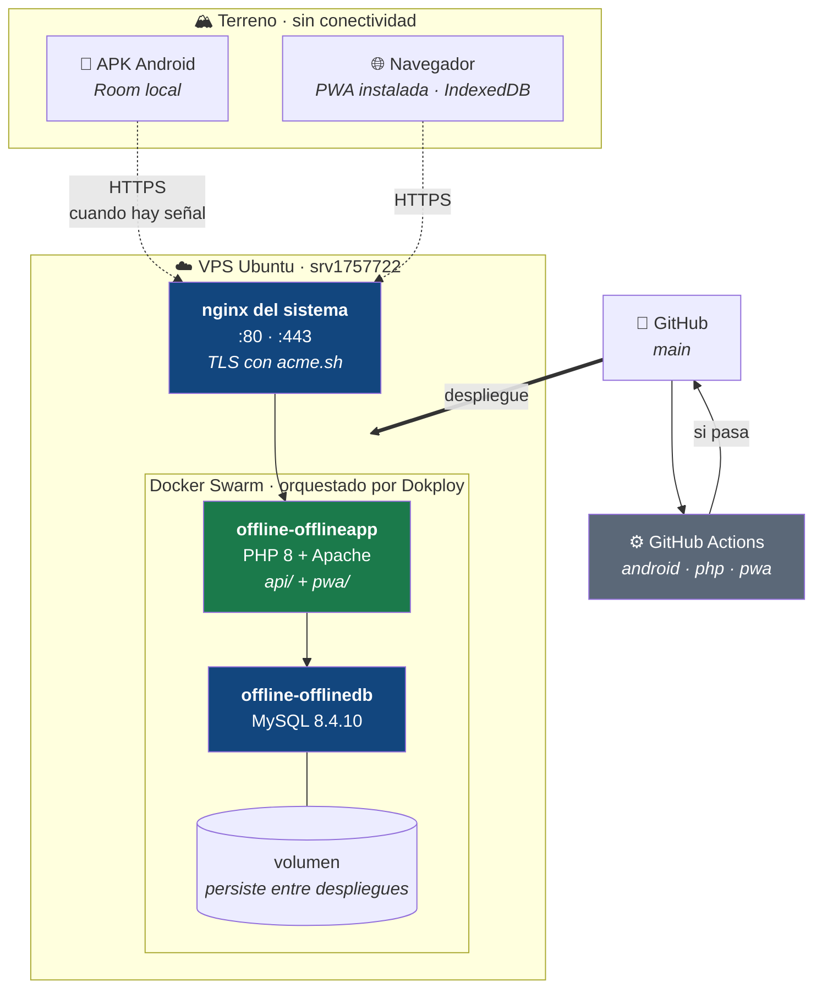
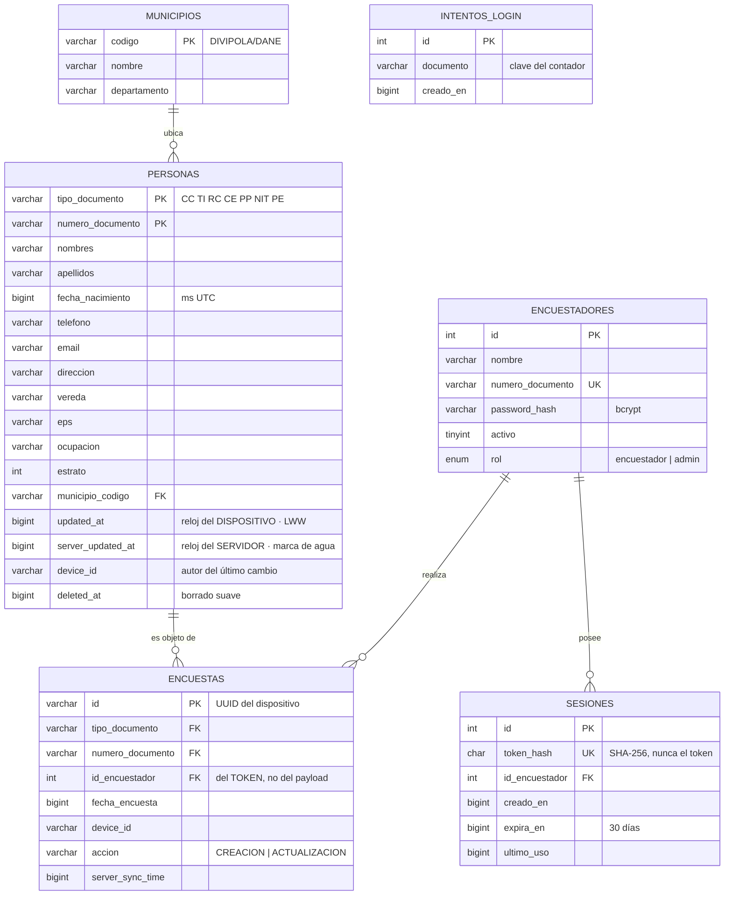
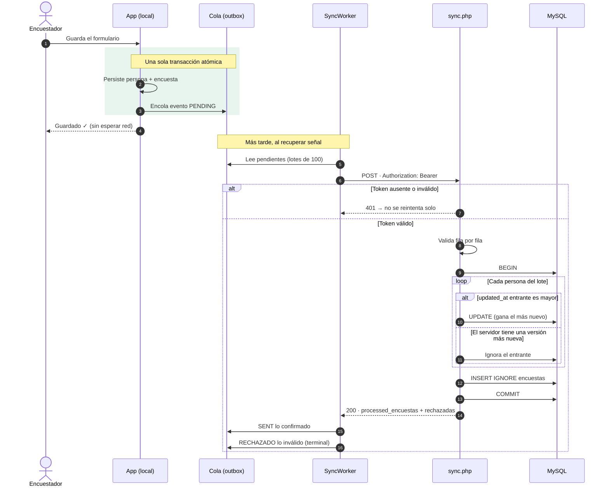
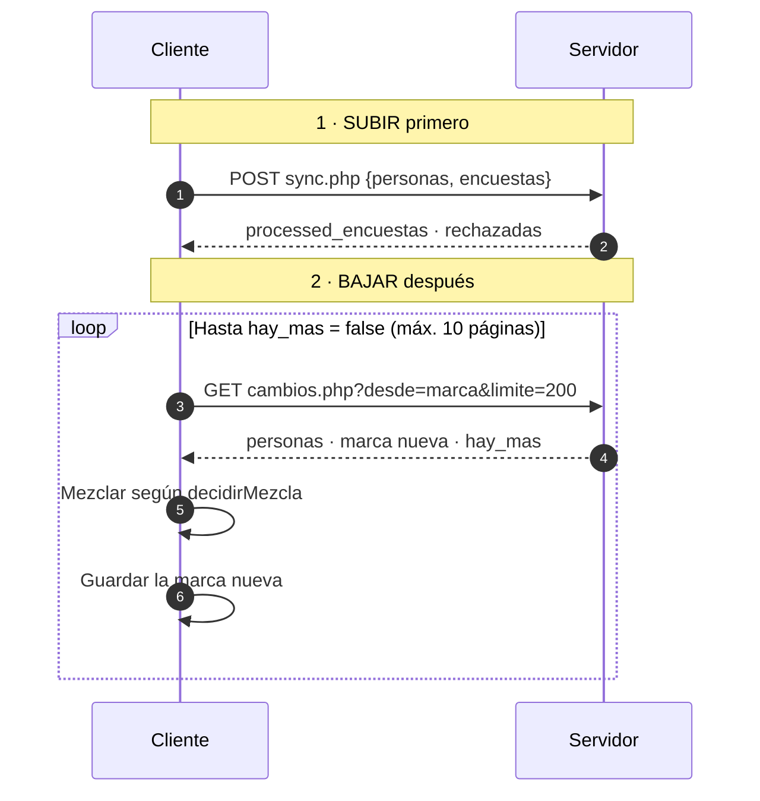
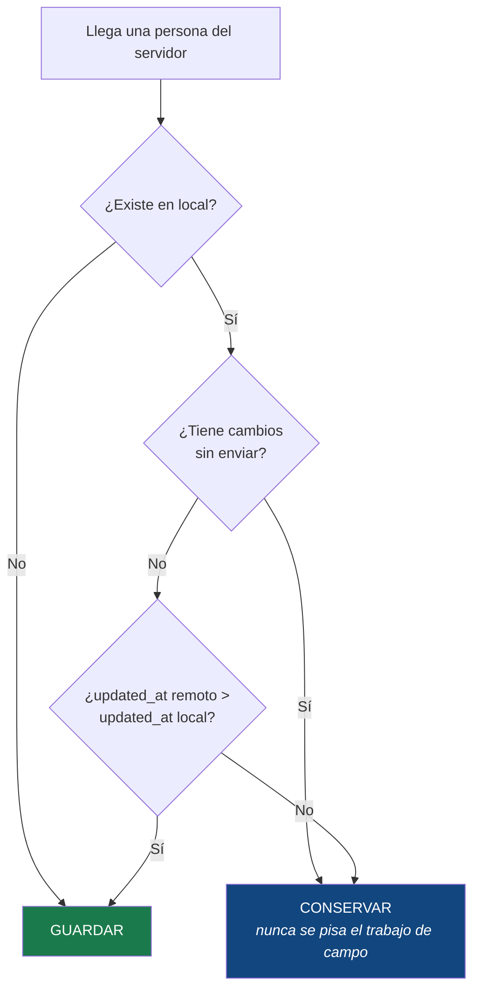
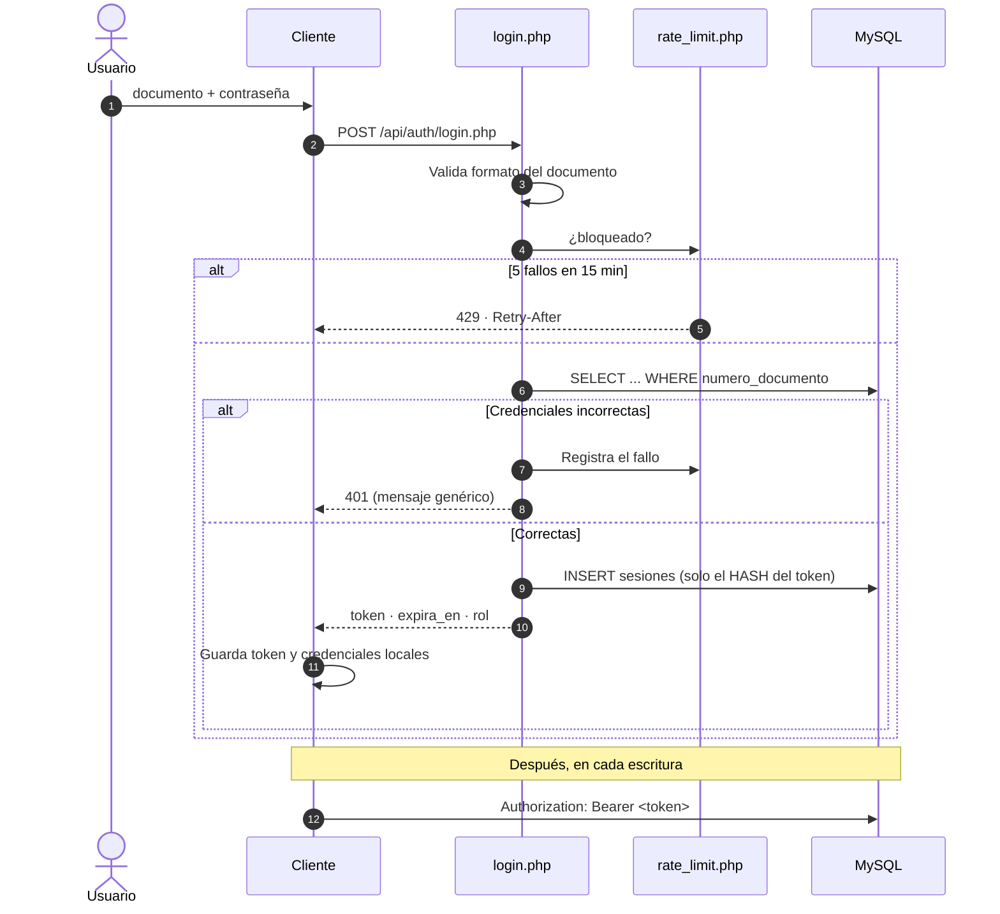
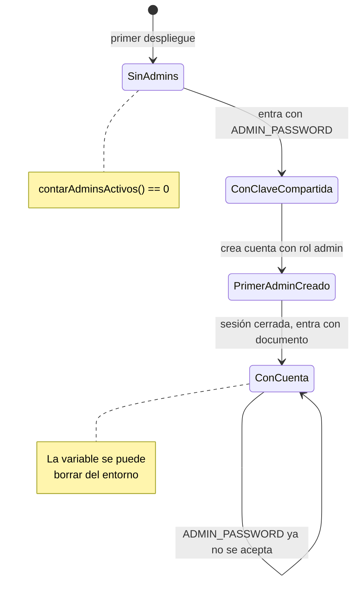

# Arquitectura

Documento de referencia técnica del sistema de encuestas *offline-first* del Ministerio de Salud.

> Los diagramas están en Mermaid. GitHub los renderiza directamente; en VS Code hace falta la extensión *Markdown Preview Mermaid Support*.

## Índice

1. [Panorama general](#1-panorama-general)
2. [Diagrama de componentes](#2-diagrama-de-componentes)
3. [Diagrama de despliegue](#3-diagrama-de-despliegue)
4. [Modelo de datos](#4-modelo-de-datos)
5. [Flujos principales](#5-flujos-principales)
6. [Decisiones de arquitectura](#6-decisiones-de-arquitectura)
7. [Estructura de carpetas](#7-estructura-de-carpetas)

---

## 1. Panorama general

El sistema resuelve un problema concreto: **encuestadores del Ministerio de Salud recogen datos demográficos en zonas rurales donde no hay señal**. La conectividad no es una condición para trabajar, es un evento que ocurre a veces.

De ahí se derivan las tres propiedades que gobiernan todo el diseño:

| Propiedad | Qué implica |
|---|---|
| **El dispositivo es la fuente de verdad temporal** | Se guarda y se sigue trabajando sin preguntarle nada a la red. |
| **Nada se pierde ante un cierre inesperado** | Todo lo pendiente vive en disco, no en memoria (patrón Outbox). |
| **Los conflictos se resuelven solos** | Dos encuestadores pueden tocar a la misma persona; el sistema decide sin intervención humana (Last-Write-Wins). |

Hay **dos clientes independientes** —una app Android nativa y una PWA— que escriben contra la **misma API**. No comparten código: cada uno tiene su propia base local, su propia cola y su propia implementación de la sincronización. Lo que sí comparten es el **contrato** (la API) y las **reglas de resolución de conflictos**, que están replicadas deliberadamente en ambos y verificadas con pruebas equivalentes.

---

## 2. Diagrama de componentes

```mermaid
graph TB
    subgraph Android["📱 App Android · Kotlin + Compose"]
        direction TB
        AP["<b>Presentation</b><br/>4 pantallas Compose<br/>ViewModels · StateFlow"]
        AD["<b>Domain</b><br/>14 casos de uso<br/>DecisionMezcla · Validaciones<br/><i>Kotlin puro, sin framework</i>"]
        ADA["<b>Data</b><br/>Repositorios · Mappers · DTOs"]
        ARoom[("<b>Room v4</b><br/>personas · encuestas<br/>cola_sincronizacion · municipios")]
        APrefs[["SharedPreferences<br/><i>token · marca de descarga</i>"]]
        AW["<b>SyncWorker</b><br/>WorkManager + backoff"]
        AP --> AD
        ADA -. implementa .-> AD
        ADA --> ARoom
        ADA --> APrefs
        AW --> AD
    end

    subgraph PWA["🌐 PWA · JavaScript sin framework"]
        direction TB
        PS["<b>Pantallas</b><br/>login · lista · formulario · sync"]
        PR["router.js<br/><i>hash routing</i>"]
        PSync["<b>sync.js</b><br/>subida por lotes + descarga<br/>repartirRespuesta"]
        PDB["<b>db.js</b><br/>decidirMezcla"]
        PIDB[("<b>IndexedDB</b><br/>personas · sync_queue<br/>credenciales · municipios")]
        PSW["<b>Service Worker</b> v16<br/><i>HTML red-primero</i><br/><i>estáticos caché-primero</i>"]
        PR --> PS
        PS --> PSync
        PS --> PDB
        PSync --> PDB
        PDB --> PIDB
    end

    subgraph API["⚙️ API REST · PHP 8 sin framework"]
        direction TB
        CORS["<b>cors.php</b><br/>lista blanca · cabeceras"]
        AUTH["<b>auth_token.php</b><br/>emite y valida tokens<br/>devuelve rol"]
        RL["<b>rate_limit.php</b><br/>5 fallos → 15 min"]
        ESQ["<b>esquema.php</b><br/>automigración"]
        LOGIN["auth/login.php<br/><i>bcrypt → token</i>"]
        LOGOUT["auth/logout.php<br/><i>revoca</i>"]
        SYNC["personas/sync.php<br/><i>SUBIDA · LWW · transacción</i>"]
        CAMB["personas/cambios.php<br/><i>BAJADA · marca de agua</i>"]
        MUNI["municipios/index.php"]
        ADMIN["admin/index.php<br/><i>panel · CSRF · sesión PHP</i>"]
        ADMINQ["admin/consultas.php<br/><i>SQL del panel</i>"]
        LOGIN --> AUTH
        LOGIN --> RL
        LOGOUT --> AUTH
        SYNC --> AUTH
        CAMB --> AUTH
        SYNC --> ESQ
        CAMB --> ESQ
        ADMIN --> RL
        ADMIN --> ADMINQ
    end

    DB[("🗄️ <b>MySQL 8.4</b><br/>municipios · encuestadores<br/>personas · encuestas<br/>sesiones · intentos_login")]

    AW ==>|"POST · Bearer"| SYNC
    AW ==>|"GET · Bearer"| CAMB
    ADA -->|login / logout| LOGIN
    ADA --> MUNI
    PSync ==>|"POST · Bearer"| SYNC
    PSync ==>|"GET · Bearer"| CAMB
    PS -->|login / logout| LOGIN

    LOGIN --> DB
    LOGOUT --> DB
    SYNC --> DB
    CAMB --> DB
    MUNI --> DB
    ADMINQ --> DB
    RL --> DB
    ESQ --> DB

    style AD fill:#1B7A4B,color:#fff
    style AUTH fill:#B3261E,color:#fff
    style RL fill:#B3261E,color:#fff
    style SYNC fill:#12467E,color:#fff
    style CAMB fill:#12467E,color:#fff
    style DB fill:#12467E,color:#fff
    style PSync fill:#1B7A4B,color:#fff
    style PDB fill:#1B7A4B,color:#fff
```



### Responsabilidades y fronteras

Lo que un componente **no** hace suele importar más que lo que hace: es la frontera lo que mantiene el diseño en pie.

| Componente | Responsabilidad | Qué NO hace |
|---|---|---|
| `Domain` (Android) | Reglas de negocio, validaciones, resolución de mezcla | No conoce Room, Retrofit ni Android. Por eso se puede probar en la JVM sin emulador. |
| `Data` (Android) | Persistencia y red; implementa las interfaces del dominio | No decide reglas de negocio |
| `Presentation` (Android) | Pintar estado y recoger eventos | No contiene lógica de negocio |
| `SyncWorker` | Reintentar con backoff cuando hay red | No transforma datos |
| `cors.php` | Lista blanca de orígenes y cabeceras de seguridad | No autentica |
| `auth_token.php` | Emitir, validar y revocar tokens; resolver el rol | No decide qué puede hacer cada rol |
| `rate_limit.php` | Contar fallos y calcular bloqueo | No responde por sí mismo (devuelve segundos) |
| `esquema.php` | Crear columnas que falten | No mueve datos entre tablas |
| `sync.php` | Validar el lote, resolver LWW, transacción atómica | No confía en el `id_encuestador` del cliente |
| `cambios.php` | Entregar lo cambiado desde una marca | No decide qué conserva el cliente |
| Service Worker | Servir la app sin conexión | No cachea `/api/` |

### Las reglas duplicadas a propósito

Dos piezas están **replicadas** en Android y en la PWA, y eso es intencional:

| Regla | Android | PWA |
|---|---|---|
| Qué hacer con una persona descargada | [`DecisionMezcla.kt`](../app/src/main/java/com/minsalud/encuestas/domain/sync/DecisionMezcla.kt) | `decidirMezcla` en [`db.js`](../pwa/js/db.js) |
| Qué se reintenta tras un envío parcial | `SyncRepositoryImpl` | `repartirRespuesta` en [`sync.js`](../pwa/js/sync.js) |

No se comparte código porque las plataformas no lo permiten sin añadir un runtime intermedio que costaría más de lo que ahorra. Lo que sí se comparte es **la especificación y las pruebas**: `DecisionMezclaTest.kt` y `mezcla.test.mjs` cubren los mismos casos. Si un cliente cambia de criterio, la otra suite lo delata.

---

## 3. Diagrama de despliegue



**URL de producción:** `https://encuestas.manuelcardenas.online`
· PWA en `/pwa/` · API en `/api/` · Panel en `/api/admin/`

### Detalles operativos que no son evidentes

- **Los nombres de contenedor cambian en cada despliegue.** Swarm añade un sufijo de tarea (`offline-offlinedb-hkxh38.1.<taskid>`). Hay que obtenerlos con `docker ps`, no fijarlos en un script.
- **El `docker-compose.yml` del repositorio no es lo que corre.** Declara `container_name` e `image: mysql:8.0`; en producción hay nombres de Swarm y MySQL 8.4. Editarlo no cambia producción.
- **El volumen de MySQL sobrevive a los despliegues.** Por eso `MYSQL_PASSWORD` del compose se ignora en cada redespliegue: solo lo aplica el arranque inicial sobre un volumen vacío. Ver [rotación de credenciales](#rotación-de-credenciales-de-base-de-datos) más abajo.
- **No hay acceso a consola de base de datos en el flujo normal.** Por eso los cambios de esquema se aplican solos (`api/esquema.php`).

---

## 4. Modelo de datos

### Servidor (MySQL)



### Las dos marcas de tiempo

Es la decisión de diseño más importante del sistema y la más fácil de malinterpretar:

| Campo | Lo pone | Para qué sirve | Por qué no sirve para lo otro |
|---|---|---|---|
| `updated_at` | El **dispositivo** | Resolver conflictos (LWW) | No sirve como marca de agua: un teléfono con el reloj atrasado escribiría filas con fecha vieja que los demás ya superaron, y **esas filas no se descargarían nunca**. |
| `server_updated_at` | El **servidor** | Marca de agua de la descarga incremental | No sirve para LWW: todos los cambios de un mismo lote comparten sello, así que no distingue cuál es más reciente en origen. |

El fallo que evita el segundo campo **no produce ningún error**: los datos simplemente no llegan, y nadie se entera.

### Cliente Android (Room v4)

Espeja las tablas del servidor y añade la cola:

| Tabla | Notas |
|---|---|
| `personas` | Clave compuesta. Índice `(deleted_at, updated_at)` para el listado. |
| `encuestas` | Historial local. |
| `cola_sincronizacion` | Outbox. Estados `PENDING · SENT · ERROR · RECHAZADO`. |
| `municipios` | Catálogo, sembrado localmente. |

**Migraciones:** v1→v2 añade `vereda`; v2→v3 crea el índice de listado; v3→v4 añade `server_updated_at`. Ninguna destructiva. El esquema exportado vive en [`app/schemas/`](../app/schemas/) y CI lo valida en cada compilación.

### Cliente PWA (IndexedDB)

| Almacén | Contenido |
|---|---|
| `personas` | Clave compuesta `[tipo_documento, numero_documento]`, más el campo local `_pendingSync`. |
| `sync_queue` | Outbox con `status` y el motivo del rechazo. |
| `credenciales` | Documento y hash para el inicio de sesión sin red. |
| `municipios` | Catálogo. |

---

## 5. Flujos principales

### 5.1 Registro sin conexión (patrón Outbox)



**Lo que protege el paso 3–4:** si la app muere entre guardar y enviar, la cola sobrevive en disco. El registro nunca queda solo en memoria.

**Lo que protege el último paso:** solo se marca `SENT` lo que el servidor confirma. Y lo que rechaza se marca **terminal**, para que un registro irreparable no se reintente en cada sincronización arrastrando a su lote.

### 5.2 Sincronización bidireccional



**El orden importa.** Subiendo primero, el servidor ya conoce los cambios locales cuando se le pregunta, y se evita un conflicto que no hacía falta tener.

### 5.3 Regla de mezcla al descargar



La rama del medio es la que evita perder datos: un registro pendiente todavía no llegó al servidor, así que lo que vuelve es por fuerza anterior. Sobrescribirlo borraría una encuesta recién hecha **sin producir ningún error**.

### 5.4 Autenticación y roles



El token se guarda en el servidor **solo como hash SHA-256**: una filtración de la tabla `sesiones` no permite suplantar a nadie. La vigencia es de 30 días porque el token se emite con conectividad y viaja con el dispositivo al terreno.

### 5.5 Arranque del panel de administración



El secreto compartido **se apaga solo**. No hay que acordarse de retirar nada para que deje de valer.

---

## 6. Decisiones de arquitectura

### ADR-01 · Last-Write-Wins en lugar de CRDT o resolución manual

**Contexto.** Dos encuestadores pueden visitar a la misma persona el mismo día, sin señal, y ambos editarla.

**Decisión.** El servidor compara `updated_at` y conserva el más reciente. Sin intervención humana.

**Alternativas descartadas.** Un CRDT resolvería a nivel de campo sin perder nada, pero exige estructuras de datos que el equipo tendría que mantener en Kotlin, JavaScript y PHP a la vez. La resolución manual pondría a un funcionario a arbitrar diferencias entre encuestas, que es exactamente el trabajo que el sistema debe evitar.

**Consecuencia aceptada.** Si dos personas editan campos distintos del mismo registro, se pierde la edición más antigua **completa**, no solo el campo en conflicto. Se asume porque en el terreno real dos encuestadores rara vez cubren la misma vereda el mismo día.

### ADR-02 · Dos marcas de tiempo separadas

**Contexto.** La descarga incremental necesita preguntar "dame lo cambiado desde X".

**Decisión.** `updated_at` (dispositivo) para LWW; `server_updated_at` (servidor) como marca de agua.

**Por qué no basta una.** Con solo `updated_at`, un teléfono con el reloj atrasado escribe filas fechadas por debajo de la marca que otros dispositivos ya tienen. Esas filas **jamás se descargarían**, y el fallo no genera error: el dato simplemente no aparece.

### ADR-03 · Rechazo por fila, no por lote

**Contexto.** `sync.php` validaba con una función que hace `exit`. Una fila inválida devolvía 400 y tumbaba el envío entero, de hasta 500 registros. El cliente reintentaba el mismo lote indefinidamente.

**Decisión.** Las validaciones por fila lanzan `DatoInvalido`, la fila se descarta y el lote continúa. La respuesta incluye `rechazadas` con el motivo, y el cliente las marca **terminales**.

**Consecuencia.** Un registro irreparable ya no bloquea la cola de un encuestador para siempre.

### ADR-04 · Límite de intentos por documento, no por IP

**Contexto.** La aplicación corre detrás de un proxy inverso, así que `REMOTE_ADDR` es la IP del proxy y es la misma para todos.

**Decisión.** Contar por documento. Para el panel, que no pide usuario, un contador global bajo la clave `#admin`.

**Por qué no por IP.** Bloquearía a todos los encuestadores a la vez: una denegación de servicio autoinfligida. `X-Forwarded-For` no sirve sin conocer la cadena exacta de proxies, porque un cliente puede falsificarla.

**Consecuencia aceptada.** Con contador global, alguien puede mantener el panel bloqueado a base de intentos fallidos. Se prefiere a permitir fuerza bruta ilimitada sobre un panel que puede borrar datos.

### ADR-05 · Automigración de esquema

**Contexto.** El despliegue no tiene acceso SSH ni consola de base de datos. Una migración manual dejaría una ventana con el código nuevo desplegado y la tabla vieja.

**Decisión.** `api/esquema.php` comprueba `information_schema` y crea la columna que falte en la primera petición que la necesite.

**Por qué `information_schema` y no `try/catch`.** En MySQL un `ALTER TABLE` provoca *commit* implícito. Ejecutarlo dentro de la transacción de sincronización partiría el lote a la mitad.

### ADR-06 · Borrado suave, siempre

**Contexto.** El panel necesita retirar registros que ningún cliente puede tocar.

**Decisión.** Marcar `deleted_at` y sellar `updated_at` + `server_updated_at`.

**Por qué no `DELETE`.** `cambios.php` entrega las filas borradas a propósito, para que los dispositivos se enteren. Un `DELETE` real quita la fila y no queda nada que enviar: **cada teléfono que ya la descargó se la queda para siempre**, sin forma de corregirlo desde el servidor.

### ADR-07 · Cuentas con rol en lugar de contraseña compartida

**Contexto.** El panel autenticaba contra una variable de entorno. No sabía quién entraba, así que ninguna acción administrativa tenía autor.

**Decisión.** Columna `rol` en `encuestadores`. `ADMIN_PASSWORD` solo se acepta mientras no exista ninguna cuenta admin activa.

**Consecuencia.** Al borrar una persona queda `admin:<nombre>` en `device_id`, no `panel-admin`.

### ADR-08 · La PWA sin framework

**Contexto.** La PWA debe cargar y funcionar en gama baja con conexión intermitente.

**Decisión.** JavaScript con módulos ES nativos, sin build step ni dependencias en tiempo de ejecución.

**Consecuencia.** No hay `node_modules` que servir ni bundle que invalidar; el Service Worker cachea archivos reales. El coste es que no hay reactividad automática: las pantallas se repintan a mano.

### Rotación de credenciales de base de datos

Cambiar `DB_PASS` en el entorno **no cambia la contraseña de MySQL**: el `MYSQL_PASSWORD` del compose solo lo aplica el arranque sobre un volumen vacío. Secuencia sin corte de servicio (MySQL 8.0.14+):

```sql
-- 1 · como root, dentro del contenedor de la base
ALTER USER 'encuestas_user'@'%' IDENTIFIED BY 'nueva' RETAIN CURRENT PASSWORD;
-- 2 · cambiar DB_PASS en el entorno y redesplegar
-- 3 · verificar que la API responde 401 (no 500) en cambios.php
ALTER USER 'encuestas_user'@'%' DISCARD OLD PASSWORD;
```

`RETAIN CURRENT PASSWORD` exige el privilegio `APPLICATION_PASSWORD_ADMIN`: un usuario no puede hacérselo a sí mismo. Y entrando como root, `USER()` apunta a **root** — hay que nombrar la cuenta literal o se le cambia la contraseña a quien no es.

---

## 7. Estructura de carpetas

```
proyecto_offline/
├── api/                         # API REST en PHP, sin framework
│   ├── admin/
│   │   ├── index.php            # Panel: vista + acciones
│   │   └── consultas.php        # Todo el SQL del panel
│   ├── auth/
│   │   ├── login.php            # bcrypt → token
│   │   └── logout.php           # revoca el token
│   ├── personas/
│   │   ├── sync.php             # SUBIDA · LWW · transacción
│   │   └── cambios.php          # BAJADA · marca de agua
│   ├── municipios/index.php
│   ├── auth_token.php           # emitir / validar / rol
│   ├── cors.php                 # lista blanca + cabeceras
│   ├── db.php                   # conectarBD()
│   ├── esquema.php              # automigración
│   └── rate_limit.php           # anti fuerza bruta
│
├── app/                         # Android nativo · Clean Architecture
│   └── src/main/java/com/minsalud/encuestas/
│       ├── domain/              # Kotlin puro
│       │   ├── model/ usecase/ repository/
│       │   ├── sync/            # DecisionMezcla
│       │   └── validation/
│       ├── data/
│       │   ├── local/           # Room · DAOs · entidades · prefs
│       │   ├── remote/          # Retrofit · DTOs
│       │   ├── repository/      # implementaciones
│       │   └── mapper/
│       ├── presentation/        # Compose · ViewModels · theme
│       ├── di/                  # Hilt
│       └── worker/              # SyncWorker
│
├── pwa/                         # PWA sin framework
│   ├── css/                     # 7 hojas por responsabilidad
│   ├── js/
│   │   ├── screens/             # login · lista · formulario · sync
│   │   ├── db.js                # IndexedDB + decidirMezcla
│   │   ├── sync.js              # subida/bajada + repartirRespuesta
│   │   └── api.js router.js session.js utils.js
│   ├── tests/                   # node --test, sin dependencias
│   └── sw.js                    # Service Worker
│
├── database/
│   ├── schema.sql               # esquema completo + municipios DANE
│   └── migrations/              # histórico versionado
│
├── docs/                        # esta documentación
└── .github/workflows/ci.yml     # android · php · pwa
```

---

## Documentos relacionados

- [Historias de usuario](HISTORIAS-DE-USUARIO.md) — qué hace el sistema, con criterios de aceptación
- [Referencia de la API](API.md) — endpoints, parámetros y respuestas
- [Pendientes y hoja de ruta](PENDIENTES.md) — qué falta y por qué
- [README](../README.md) — puesta en marcha
