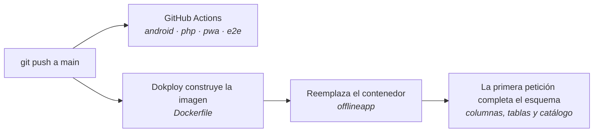

# Despliegue y operación · paso a paso

Todo lo que hay que hacer **fuera del código** para tener ColOffline completo: activar el correo de «¿Olvidaste tu contraseña?», desplegar el servidor, distribuir la app y publicarla en Google Play.

**Última revisión:** 10 de octubre de 2026.

---

## 0 · Lista de cierre

Marca cada paso a medida que lo hagas. Los detalles están en las secciones de abajo.

| # | Qué | Dónde | Sección |
|---|---|---|---|
| ☐ 1 | Crear una cuenta de Gmail para enviar los correos | gmail.com | [1.1](#11--la-cuenta-de-gmail-que-envía) |
| ☐ 2 | Activar la verificación en 2 pasos en esa cuenta | myaccount.google.com | [1.2](#12--activar-la-verificación-en-2-pasos) |
| ☐ 3 | Crear la contraseña de aplicación (16 letras) | myaccount.google.com/apppasswords | [1.3](#13--crear-la-contraseña-de-aplicación) |
| ☐ 4 | Poner las variables `SMTP_*` en Dokploy y redesplegar | Dokploy | [1.5](#15--poner-las-variables-en-dokploy) |
| ☐ 5 | Poner tu correo en tu cuenta de administrador y «Enviar correo de prueba» | Panel → Cuentas | [1.6](#16--probar-desde-el-panel) |
| ☐ 6 | Poner el correo de cada encuestador que lo tenga | Panel → Cuentas | [1.7](#17--correo-de-cada-encuestador) |
| ☐ 7 | Probar «¿Olvidaste tu contraseña?» de punta a punta | App en el celular | [1.8](#18--probar-el-flujo-completo) |
| ☐ 8 | Retirar `ADMIN_PASSWORD` de Dokploy (si sigue ahí) | Dokploy | [2.2](#22--variables-de-entorno) |
| ☐ 9 | Programar copias de seguridad de la base | VPS | [2.5](#25--copias-de-seguridad) |
| ☐ 10 | Hacer las pruebas de campo | Celular real | [PRUEBAS-DE-CAMPO.md](PRUEBAS-DE-CAMPO.md) |
| ☐ 11 | Crear la llave de firma de Android y guardarla en dos lugares | Tu PC | [4.2](#42--crear-la-llave-de-firma-una-sola-vez) |
| ☐ 12 | Publicar en Google Play (prueba interna → cerrada → producción) | play.google.com/console | [5](#5--publicar-en-google-play) |

---

## 1 · Activar «¿Olvidaste tu contraseña?»

### Cómo funciona

1. En la app (o desde el login del panel) la persona toca **¿Olvidaste tu contraseña?** y escribe su documento.
2. El servidor envía un **código de 6 dígitos** al correo registrado en su cuenta. Vence en 15 minutos y admite 5 intentos.
3. La persona escribe el código y su contraseña nueva (mínimo 10 caracteres).
4. Se cierran sus sesiones en todos los celulares y le llega un correo avisando del cambio.

**Si la cuenta no tiene correo**, la app le dice que pida a su administrador una contraseña nueva. El administrador la cambia en *Panel → Cuentas → editar la cuenta → Contraseña*.

Mientras el correo no esté configurado, la app responde «La recuperación por correo no está activada…» y el panel lo muestra en *Cuentas*. **Nada se rompe**: simplemente se usa el camino del administrador.

### ¿Hace falta Google Cloud Console?

**No.** Para que un servidor *envíe* correos con Gmail basta una **contraseña de aplicación** y el servidor SMTP de Gmail. Google Cloud Console solo haría falta para usar la API de Gmail con OAuth (credenciales de cliente, pantalla de consentimiento, tokens que hay que renovar), y eso agrega piezas que se pueden romper sin aportar nada aquí. El código ya habla SMTP directamente; no requiere ninguna librería.

> Si más adelante prefieres otro proveedor (Brevo, Mailgun, Amazon SES, el correo institucional), se usan **las mismas variables** con el servidor y la clave de ese proveedor.

### 1.1 · La cuenta de Gmail que envía

Usa una cuenta **personal** de Gmail **solo para esto**, por ejemplo `coloffline.notificaciones@gmail.com`:

- Si mañana cambias la contraseña de tu Gmail personal, Google **revoca** todas sus contraseñas de aplicación y la recuperación dejaría de funcionar sin avisar.
- Las cuentas de **Google Workspace** (de una empresa o institución) pueden no permitir contraseñas de aplicación. Una cuenta @gmail.com sí las permite.
- Gmail admite unos **500 correos al día**: de sobra para códigos de recuperación.

Para crearla: [accounts.google.com/signup](https://accounts.google.com/signup) → *Para uso personal*.

### 1.2 · Activar la verificación en 2 pasos

Las contraseñas de aplicación solo existen con la verificación en 2 pasos activa.

1. Entra con la cuenta nueva a [myaccount.google.com](https://myaccount.google.com).
2. Menú izquierdo → **Seguridad** (o *Seguridad y acceso*).
3. Busca **Verificación en 2 pasos** → **Activar** / *Comenzar*.
4. Agrega un número de teléfono, escribe el código que te llega por SMS y confirma **Activar**.

> No la configures **solo** con llaves de seguridad físicas: en ese caso Google no ofrece contraseñas de aplicación.

### 1.3 · Crear la contraseña de aplicación

1. Ve directo a **[myaccount.google.com/apppasswords](https://myaccount.google.com/apppasswords)** (el menú de Seguridad ya no siempre muestra el enlace).
2. Si te la pide, escribe de nuevo la contraseña de la cuenta.
3. En **Nombre de la app** escribe `ColOffline servidor` → **Crear**.
4. Aparece un recuadro con **16 letras** en cuatro grupos (`abcd efgh ijkl mnop`). **Cópialas ya**: Google no las vuelve a mostrar.
5. Quítale los espacios: `abcdefghijklmnop`. Esa es tu `SMTP_CLAVE`.

Si la pierdes, en la misma página elimina la vieja y crea otra.

### 1.4 · Los valores que vas a poner

| Variable | Valor | Notas |
|---|---|---|
| `SMTP_HOST` | `smtp.gmail.com` | |
| `SMTP_PUERTO` | `465` | SSL directo. Si tu servidor bloquea el 465, usa `587` (STARTTLS) |
| `SMTP_USUARIO` | `coloffline.notificaciones@gmail.com` | La cuenta completa |
| `SMTP_CLAVE` | `abcdefghijklmnop` | La contraseña de aplicación, **sin espacios**. Nunca la contraseña normal de Gmail |
| `SMTP_REMITENTE` | `coloffline.notificaciones@gmail.com` | La misma cuenta (Gmail reescribe cualquier otra) |
| `SMTP_NOMBRE` | `ColOffline` | Lo que ve quien recibe el correo |

### 1.5 · Poner las variables en Dokploy

Producción la despliega **Dokploy**, no el `docker-compose.yml` del repositorio, así que las variables van en Dokploy:

1. Abre tu panel de **Dokploy** e inicia sesión.
2. Entra al proyecto **offline** → a la aplicación **offlineapp** (la de PHP, no la base de datos).
3. Pestaña **Environment** (Entorno).
4. Al final de lo que ya hay, pega (con tus valores):
   ```
   SMTP_HOST=smtp.gmail.com
   SMTP_PUERTO=465
   SMTP_USUARIO=coloffline.notificaciones@gmail.com
   SMTP_CLAVE=abcdefghijklmnop
   SMTP_REMITENTE=coloffline.notificaciones@gmail.com
   SMTP_NOMBRE=ColOffline
   ```
5. **Save** (Guardar).
6. Arriba, **Deploy** (o *Redeploy*). Las variables nuevas solo llegan al contenedor al redesplegar. Espera a que el despliegue diga *Done* / *Success*.

> No borres las variables que ya están (`DB_HOST`, `DB_NAME`, `DB_USER`, `DB_PASS`, `ALLOWED_ORIGINS`…): sin ellas la app no se conecta a la base.

### 1.6 · Probar desde el panel

1. Entra al panel: <https://encuestas.manuelcardenas.online/api/admin/>.
2. Ve a **Cuentas**. Arriba debe decir **«Recuperación de contraseña por correo: activada»**. Si dice *sin configurar*, las variables no llegaron: revisa el paso 1.5 y vuelve a desplegar.
3. Edita **tu** cuenta de administrador → campo **Correo** → escribe tu correo → **Guardar cambios**.
4. Toca **Enviar correo de prueba**.
5. Revisa tu bandeja de entrada y la carpeta **Spam**. Si llegó a Spam, márcalo como *No es spam*: los siguientes llegarán a la bandeja.

Si sale *«No se pudo enviar el correo»*:

| Causa probable | Qué hacer |
|---|---|
| `SMTP_CLAVE` con espacios o es la contraseña normal | Pega las 16 letras juntas; crea otra si dudas |
| La cuenta no tiene verificación en 2 pasos | Paso 1.2 y crea la contraseña de aplicación otra vez |
| El servidor no puede salir por el puerto 465 | Prueba `SMTP_PUERTO=587` y redespliega. Para comprobarlo desde el VPS: `docker exec $(docker ps --format '{{.Names}}' \| grep offlineapp) php -r 'var_dump((bool) @stream_socket_client("ssl://smtp.gmail.com:465", $e, $m, 10));'` debe imprimir `bool(true)` |
| Cambiaste la contraseña de esa cuenta de Google | Se revocaron las contraseñas de aplicación: crea una nueva |

El detalle exacto de cada fallo queda en el log del contenedor (`docker logs <contenedor> | grep correo`), nunca en pantalla.

### 1.7 · Correo de cada encuestador

*Panel → Cuentas →* clic en la cuenta → **Correo** → **Guardar cambios**. Es opcional: quien no tenga correo sigue pudiendo pedirle el cambio al administrador.

### 1.8 · Probar el flujo completo

1. En el celular, abre la app y toca **¿Olvidaste tu contraseña?**
2. Escribe el documento de una cuenta con correo → **Enviarme un código**.
3. Abre el correo «Tu código de ColOffline: 123456».
4. Escribe el código y dos veces la contraseña nueva → **Cambiar contraseña**.
5. **Ir a iniciar sesión** y entra con la nueva. Debe llegar además el correo «Tu contraseña de ColOffline cambió».

Protecciones que ya están activas (no hay que configurarlas): el mensaje es el mismo exista o no la cuenta, 5 pedidos de código por documento cada 15 minutos, 5 intentos por código, el código sirve una sola vez y se guarda solo cifrado.

---

## 2 · Desplegar el servidor

### 2.1 · Cómo se despliega



- Cada `push` a `main` despliega. **Revisa que el CI esté en verde** en la pestaña *Actions* de GitHub (o en el PR) antes de mezclar.
- No hay migraciones manuales: `api/esquema.php` crea lo que falte (columna `email`, tablas `recuperaciones`, `ajustes`…) y completa el catálogo de municipios.
- La imagen solo lleva `api/` y `pwa/` (ver `.dockerignore`): pruebas, documentación, scripts y SQL **no** quedan publicados.

### 2.2 · Variables de entorno

En Dokploy → aplicación **offlineapp** → **Environment**:

| Variable | Obligatoria | Para qué |
|---|---|---|
| `DB_HOST`, `DB_NAME`, `DB_USER`, `DB_PASS` | Sí | Conexión a MySQL |
| `ALLOWED_ORIGINS` | Sí | Orígenes permitidos por CORS, separados por comas, sin barra final |
| `SMTP_HOST`, `SMTP_PUERTO`, `SMTP_USUARIO`, `SMTP_CLAVE`, `SMTP_REMITENTE`, `SMTP_NOMBRE` | No | Correo de «¿Olvidaste tu contraseña?» ([sección 1](#1--activar-olvidaste-tu-contraseña)) |
| `ADMIN_PASSWORD` | No | **Solo** para el primer arranque, cuando aún no hay ningún administrador. Producción ya tiene uno: **bórrala** y redespliega |

> Cambiar `DB_PASS` en Dokploy **no** cambia la contraseña dentro de MySQL. Para rotarla sin cortar el servicio sigue [ARQUITECTURA · Rotación de credenciales](ARQUITECTURA.md#rotación-de-credenciales-de-base-de-datos).

### 2.3 · Verificar después de cada despliegue

```bash
curl -s https://encuestas.manuelcardenas.online/api/health.php
# {"success":true,"api":"ok","base_de_datos":"ok",...}

curl -s https://encuestas.manuelcardenas.online/pwa/sw.js | grep "const CACHE"
# const CACHE = 'encuestas-v22';   ← la versión del último cambio de la PWA
```

Y en el navegador: el login del panel abre, *Resumen* muestra datos y en el celular la app carga (ciérrala y ábrela para que tome la versión nueva).

### 2.4 · Si algo sale mal: volver atrás

- **Lo más rápido:** en Dokploy → aplicación → **Deployments**, busca el despliegue anterior que funcionaba y usa *Rollback* (si tu versión de Dokploy no lo muestra, usa el camino de abajo).
- **Desde el código:** `git revert <commit>` en `main` y `git push`. Se despliega la versión corregida.
- La base **no** se toca al volver atrás: los cambios de esquema solo agregan columnas y tablas, nunca borran.

### 2.5 · Copias de seguridad

Desde el VPS (el nombre del contenedor cambia en cada despliegue, por eso se busca):

```bash
DB=$(docker ps --format '{{.Names}}' | grep offlinedb)
mkdir -p ~/respaldos
docker exec "$DB" sh -c 'exec mysqldump -u root -p"$MYSQL_ROOT_PASSWORD" --single-transaction minsalud_encuestas' \
  | gzip > ~/respaldos/coloffline-$(date +%F).sql.gz
ls -lh ~/respaldos
```

Para que se haga sola cada noche a las 2:00 y se guarden 30 días, `crontab -e` y agrega:

```
0 2 * * * DB=$(docker ps --format '{{.Names}}' | grep offlinedb); docker exec "$DB" sh -c 'exec mysqldump -u root -p"$MYSQL_ROOT_PASSWORD" --single-transaction minsalud_encuestas' | gzip > ~/respaldos/coloffline-$(date +\%F).sql.gz; find ~/respaldos -name 'coloffline-*.sql.gz' -mtime +30 -delete
```

**Restaurar** (¡reemplaza los datos actuales!):

```bash
gunzip -c ~/respaldos/coloffline-2026-10-10.sql.gz | docker exec -i "$DB" sh -c 'exec mysql -u root -p"$MYSQL_ROOT_PASSWORD" minsalud_encuestas'
```

Copia de vez en cuando los respaldos **fuera del VPS** (tu PC o Google Drive): si el VPS se pierde, se pierden con él.

---

## 3 · La app web (PWA)

**No hay nada que subir:** la PWA es parte del servidor y se actualiza con cada despliegue.

- **Instalarla en un celular:** abre <https://encuestas.manuelcardenas.online/pwa/> en **Chrome** → menú ⋮ → **Agregar a la pantalla principal** / *Instalar app*.
- **Tomar una versión nueva:** cerrar la app del todo y abrirla otra vez (la primera vez descarga, la segunda ya usa la nueva).
- **Primera vez en cada teléfono: con señal.** Después funciona sin conexión.

---

## 4 · La app Android

### 4.1 · APK de prueba (sin Play Store)

Para probar en tu celular o pasársela a un encuestador:

```bash
./gradlew assembleDebug
# → app/build/outputs/apk/debug/app-debug.apk
```

Envíalo por WhatsApp o Drive. En el celular, al abrirlo, Android pide permitir **instalar apps de origen desconocido** para esa app (WhatsApp, Archivos…). Al actualizar, instala encima: los datos sin enviar se conservan.

> El APK *debug* sirve para pruebas. Para distribuir de verdad usa el **firmado** (4.4) o Google Play (5).

### 4.2 · Crear la llave de firma (una sola vez)

La llave demuestra que cada versión nueva viene de ti. **Si la pierdes, no puedes publicar actualizaciones** de la misma app (salvo que uses *Firma de apps de Play*, que en 5.5 se activa y te permite recuperarla).

En tu PC, en una terminal (PowerShell o Git Bash), **fuera** de la carpeta del proyecto:

```bash
keytool -genkeypair -v -keystore C:\Users\manue\llaves\coloffline.jks -alias coloffline -keyalg RSA -keysize 2048 -validity 10000
```

Te pide:
1. Una contraseña para el almacén (mínimo 6 caracteres) → anótala.
2. Nombre, organización, ciudad, país (`CO`) → puedes poner los datos del proyecto.
3. Confirmar con `sí`.

Guarda `coloffline.jks` y su contraseña en **dos lugares** (por ejemplo, tu PC y un Google Drive privado). **Nunca** en el repositorio: `.gitignore` ya excluye `*.jks`.

### 4.3 · Decirle a Gradle dónde está la llave

Crea (o edita) el archivo `C:\Users\manue\.gradle\gradle.properties` —está en tu usuario, no en el proyecto— y agrega:

```properties
COLOFFLINE_KEYSTORE=C:/Users/manue/llaves/coloffline.jks
COLOFFLINE_KEYSTORE_CLAVE=la_contraseña_del_almacen
COLOFFLINE_ALIAS=coloffline
COLOFFLINE_ALIAS_CLAVE=la_contraseña_del_almacen
```

(Usa `/` en la ruta, también en Windows.) Si no existe ese archivo o falta la variable, el proyecto compila igual, solo que sin firmar la versión *release*.

### 4.4 · Generar la versión para publicar

1. En `app/build.gradle.kts`, **sube `versionCode`** (2 → 3 → 4…) y ajusta `versionName` (`1.1.0`, `1.2.0`…). Play rechaza un `versionCode` repetido.
2. Genera:
   ```bash
   ./gradlew bundleRelease     # AAB para Google Play → app/build/outputs/bundle/release/app-release.aab
   ./gradlew assembleRelease   # APK firmado para instalar directo → app/build/outputs/apk/release/app-release.apk
   ```
3. Comprueba la firma: `jarsigner -verify app/build/outputs/bundle/release/app-release.aab` → `jar verified.`

La app ya cumple el nivel de API que exige Play desde el 31 de agosto de 2026 (**targetSdk 36**).

---

## 5 · Publicar en Google Play

### Antes de empezar: el nombre y el Ministerio

La app se presenta como **«Ministerio de Salud»**. Google Play **rechaza** apps que aparenten ser de una entidad del gobierno sin demostrar que la representan (política de *suplantación*). Tienes dos caminos:

- **Publicarla para la entidad**: la cuenta de desarrollador debe ser de **organización** a nombre de la entidad, o adjuntar en Play Console la **autorización escrita** de la entidad.
- **Publicarla como proyecto propio**: quita «Ministerio de Salud» de la ficha y de la app (o déjalo solo en *prueba interna*, que no pasa por revisión pública).

Para pruebas con tu equipo, la **prueba interna** (5.5) basta y no tiene ese problema.

### 5.1 · Cuenta de desarrollador

1. Entra a **[play.google.com/console](https://play.google.com/console)** con la cuenta de Google que será dueña de la app.
2. Elige el tipo de cuenta:
   - **Personal**: más rápida. Si se crea ahora, Google exige una **prueba cerrada con al menos 12 personas durante 14 días seguidos** antes de dejarte pedir producción.
   - **Organización**: pide un número **D-U-N-S** de la entidad (gratuito, tarda días). No tiene el requisito de los 12 testers.
3. Paga el registro único de **25 USD** y completa la **verificación de identidad** (documento y, a veces, teléfono). Puede tardar unos días.

### 5.2 · Crear la app

*Inicio → **Crear app***:

| Campo | Valor |
|---|---|
| Nombre | `ColOffline` (o el nombre aprobado) |
| Idioma predeterminado | Español (Latinoamérica) – es-419 |
| App o juego | App |
| Gratis o de pago | Gratis |
| Declaraciones | Acepta las políticas y las leyes de exportación |

### 5.3 · Configurar la app (Panel → «Configura tu app»)

Completa cada tarea de la lista:

| Tarea | Qué poner |
|---|---|
| **Política de privacidad** | `https://encuestas.manuelcardenas.online/pwa/privacidad.html` (ya publicada) |
| **Acceso a la app** | *Toda o parte de la funcionalidad está restringida* → agregar instrucciones: «Iniciar sesión con documento 1000000001 y contraseña Demo2026Salud». Esa cuenta de prueba ya existe en producción |
| **Anuncios** | No contiene anuncios |
| **Clasificación de contenido** | Cuestionario → categoría *Todas las demás apps* → responde **No** a violencia, sexo, drogas, etc. → *Guardar* → *Enviar* |
| **Público objetivo** | 18 años o más. No está dirigida a niños |
| **Seguridad de los datos** | Ver la tabla de abajo |
| **Apps gubernamentales** | Sí, si la publica la entidad (adjunta la autorización); si no, No (y sin «Ministerio» en el nombre) |
| **Categoría** | *Productividad* (o *Medicina*). Correo de contacto: el del proyecto |

**Seguridad de los datos** (formulario *Data safety*):

| Pregunta | Respuesta |
|---|---|
| ¿Recopila o comparte datos? | Sí, recopila |
| ¿Cifrados en tránsito? | Sí (HTTPS) |
| ¿Los usuarios pueden pedir que se borren? | Sí (al administrador; está explicado en la política) |
| Tipos de datos recopilados | **Información personal**: nombre, correo, dirección, teléfono, otros (número de documento). **Información de salud** (EPS). **Identificadores**: ID de usuario e ID del dispositivo |
| ¿Se comparten con terceros? | No (el envío de correos es un proveedor de servicio, no se declara como «compartir») |
| Uso | Funcionalidad de la app y gestión de la cuenta. Sin publicidad ni análisis |
| ¿Recopilación obligatoria? | Sí |

### 5.4 · Ficha de Play Store (Crecer → Presencia en la tienda → Ficha principal)

| Campo | Contenido |
|---|---|
| Nombre de la app (30) | `ColOffline` |
| Descripción breve (80) | `Encuestas demográficas que funcionan sin señal y se envían solas.` |
| Descripción completa (4000) | El texto sugerido de abajo |
| Ícono 512×512 | [`docs/play/icono-512.png`](play/icono-512.png) |
| Gráfico de funciones 1024×500 | [`docs/play/grafico-destacado-1024x500.png`](play/grafico-destacado-1024x500.png) |
| Capturas de teléfono (2 a 8) | [`docs/play/play-1-inicio.png`](play/play-1-inicio.png) … `play-5-recuperar.png` (1080×1920) |

Descripción completa sugerida:

> ColOffline es la herramienta de los encuestadores de campo para registrar encuestas demográficas en zonas rurales, incluso donde no hay señal.
>
> • Funciona sin conexión: todo queda guardado en el teléfono y se envía solo cuando vuelve la señal.
> • Formulario que no deja errores: valida el documento según su tipo, el teléfono, los nombres y las fechas mientras escribes.
> • Busca entre los 1.122 municipios de Colombia y las EPS escribiendo unas letras, sin tildes ni mayúsculas.
> • Ves cuánto registraste hoy, cuánto falta por enviar y el estado de cada persona.
> • Si olvidas tu contraseña, recibes un código en tu correo.
>
> Requiere una cuenta asignada por el administrador del sistema.

Las imágenes se regeneran con:

```bash
node scripts/play/imagenes.mjs                                  # ícono y gráfico
CAPTURAS_PLAY=docs/play node --test tests/e2e/e2e.test.mjs      # capturas 1080×1920
```

### 5.5 · Primera versión: prueba interna

1. *Probar y publicar → Pruebas → **Prueba interna*** → *Crear versión*.
2. **Firma de apps de Play**: acepta que Google gestione la llave de firma (recomendado: si pierdes tu llave de subida, se puede recuperar).
3. Sube `app/build/outputs/bundle/release/app-release.aab` (paso 4.4).
4. Nombre de la versión: `1.1.0 (2)`. Notas: «Primera versión de prueba».
5. *Siguiente* → revisa advertencias → **Guardar y publicar**.
6. Pestaña **Testers** → crea una lista con los correos de Gmail de quienes probarán (hasta 100) → *Guardar*.
7. Copia el **enlace de participación** y envíalo. Cada persona lo abre, acepta y luego instala desde Play Store.

La prueba interna no pasa por revisión: está disponible en minutos.

### 5.6 · Prueba cerrada y producción

1. *Pruebas → **Prueba cerrada*** → crear canal → subir la misma versión (o una nueva con `versionCode` mayor) → agregar testers.
   - **Cuenta personal:** necesitas **al menos 12 testers** que acepten el enlace y mantengan la app instalada **14 días seguidos**.
2. Cuando se cumpla, en el **Panel** aparece **Solicitar acceso a producción**: responde el cuestionario (cómo se probó, qué se cambió).
3. Aprobado el acceso: *Producción → Crear versión* → elige el AAB → **Enviar a revisión**. La revisión tarda de horas a unos días.

### 5.7 · Actualizaciones

Cada versión nueva: sube `versionCode` → `./gradlew bundleRelease` → *Producción* (o el canal de pruebas) → *Crear versión* → sube el AAB → *Enviar a revisión*. Las actualizaciones no repiten el requisito de los 12 testers.

---

## 6 · Antes de dar el proyecto por cerrado

- [ ] CI en verde en `main` (GitHub → *Actions*).
- [ ] `health.php` responde `"base_de_datos":"ok"`.
- [ ] «Enviar correo de prueba» llega.
- [ ] «¿Olvidaste tu contraseña?» probado en un celular real.
- [ ] `ADMIN_PASSWORD` retirada de Dokploy.
- [ ] Respaldo automático programado y uno copiado fuera del VPS.
- [ ] Pruebas de campo hechas ([PRUEBAS-DE-CAMPO.md](PRUEBAS-DE-CAMPO.md)).
- [ ] Llave de firma guardada en dos lugares.
- [ ] Versión en prueba interna de Google Play (y, si aplica, la autorización de la entidad).

---

## Documentos relacionados

- [Manual de uso](MANUAL.md) · [Arquitectura](ARQUITECTURA.md) · [API](API.md) · [Pruebas](PRUEBAS.md) · [Pendientes](PENDIENTES.md)
- Ayuda de Google: [contraseñas de aplicación](https://support.google.com/accounts/answer/185833) · [requisitos de prueba para cuentas personales](https://support.google.com/googleplay/android-developer/answer/14151465?hl=es-419) · [nivel de API objetivo](https://support.google.com/googleplay/android-developer/answer/11926878)
