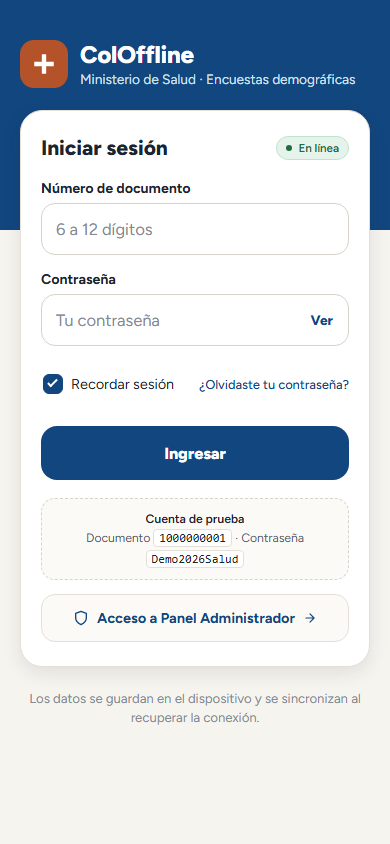
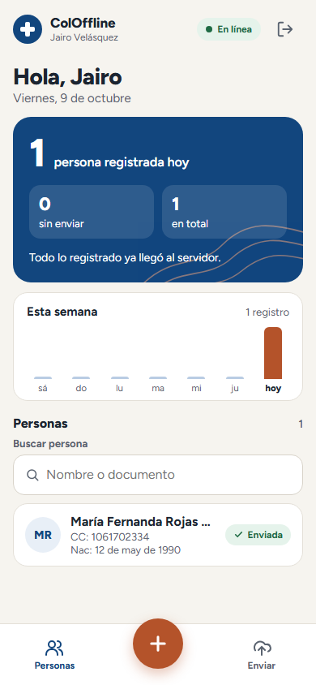
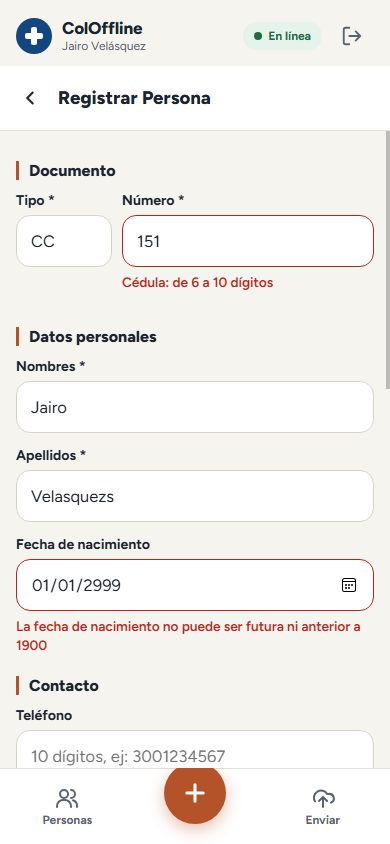
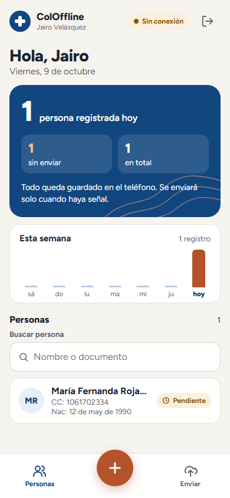
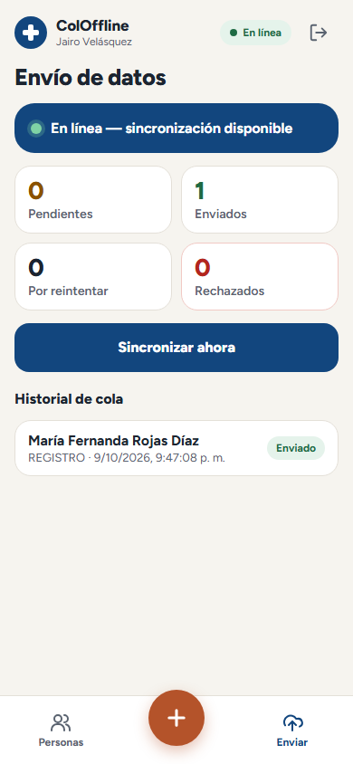
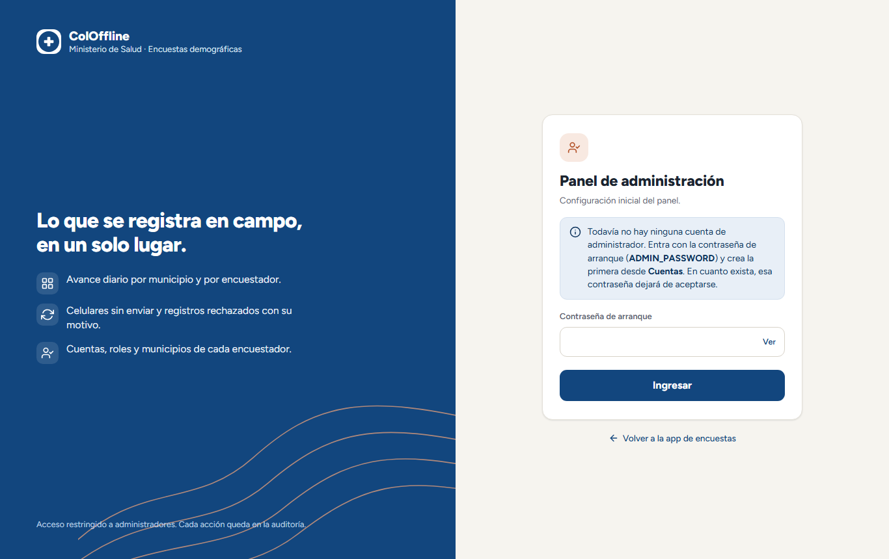
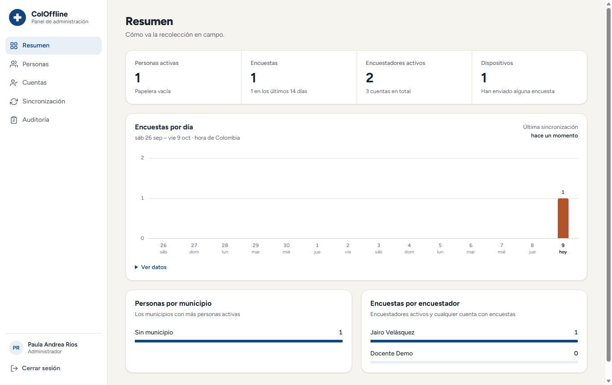
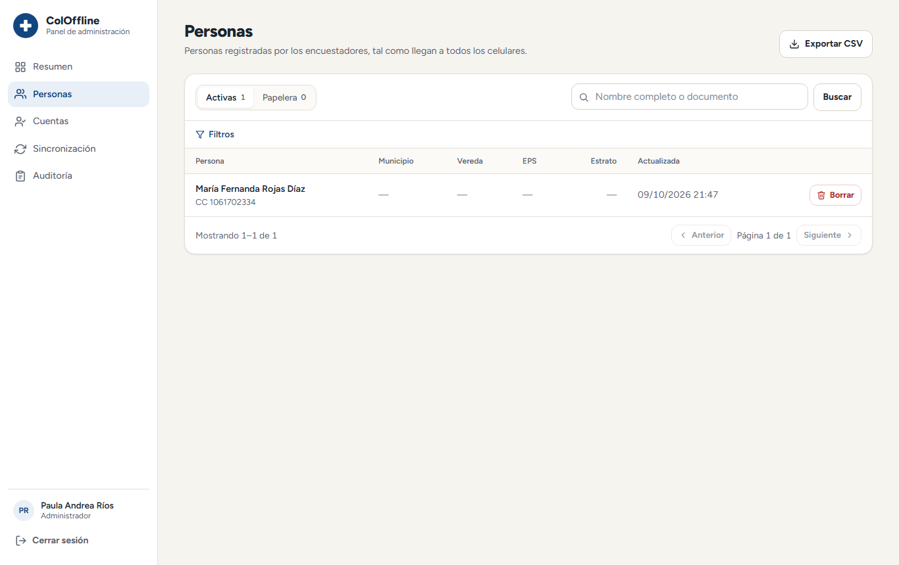
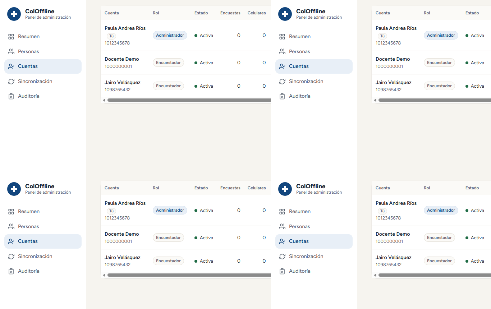
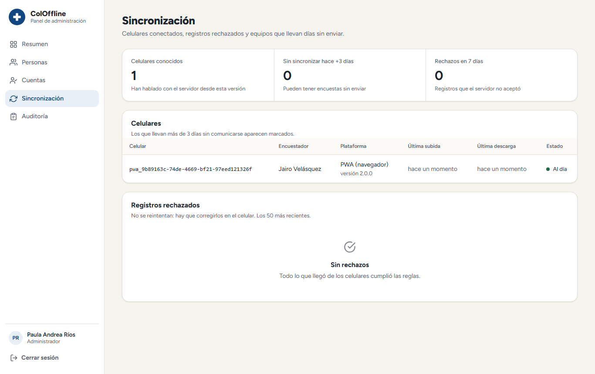

# Manual de uso

Guía para las dos personas que usan ColOffline: el **encuestador**, que registra en campo, y el **administrador**, que revisa lo que llega y gestiona las cuentas.

| | Dirección |
|---|---|
| App de encuestas (PWA) | https://encuestas.manuelcardenas.online/pwa/ |
| Panel de administración | https://encuestas.manuelcardenas.online/api/admin/ |
| App Android | APK instalado en el teléfono |

Las capturas son de la versión actual y salieron de las [pruebas de punta a punta](PRUEBAS.md#punta-a-punta-testse2e).

---

## Parte 1 · Encuestador

### 1. Entrar

1. Abre la app. La **primera vez en cada teléfono hay que tener señal**: el servidor entrega un permiso que dura 30 días.
2. Escribe tu número de documento y tu contraseña, y toca **Ingresar**.
3. Deja marcado **Recordar sesión** si el teléfono es tuyo.

Después de la primera vez puedes entrar **sin señal** con la misma cuenta.

En la PWA, desde el menú de Chrome elige **Agregar a la pantalla de inicio**: queda como una app más.

 

### 2. El inicio

- **Arriba:** tu nombre y el estado de la conexión (**En línea** o **Sin conexión**).
- **Tarjeta azul:** cuántas personas registraste hoy, cuántas faltan por enviar y el total.
- **Esta semana:** registros por día; hoy va en naranja.
- **Personas:** la lista, con buscador por nombre o documento. Cada una dice **Enviada** (✓) o **Pendiente** (reloj).
- **Barra de abajo:** *Personas*, el **botón naranja para registrar** y *Enviar*.

 

### 3. Registrar una persona

1. Toca el **botón naranja**.
2. Elige el tipo de documento. Debajo del número aparece su formato (por ejemplo, *Cédula: de 6 a 10 dígitos*).
3. Llena los datos. **El formulario no deja escribir lo que no corresponde**: letras en el documento o en el teléfono, números en el nombre.
4. Toca **Guardar**. Si algo falta o está mal, el campo se marca en rojo con el motivo; corrígelo y vuelve a guardar.

Lo que pide cada campo:

| Campo | Regla |
|---|---|
| Documento | Solo dígitos: CC 6–10 · TI y RC 10–11 · CE 6–10 · NIT 9–10 · PE 6–15. El pasaporte (PP) admite letras, 6–12 |
| Nombres y apellidos | Obligatorios. Solo letras (con tildes y ñ), espacios, guion o apóstrofo; de 2 a 60 |
| Fecha de nacimiento | Entre 1900 y hoy |
| Teléfono | 10 dígitos: celular que empieza por 3 o fijo que empieza por 60 |
| Correo | Opcional, con forma `nombre@dominio.co` |
| Dirección · vereda · EPS · ocupación | Opcionales; si se llenan, con letras y un largo mínimo |
| Estrato | De 1 a 6 |

 

### 4. Sin señal

**Trabaja igual.** Todo lo que guardas queda en el teléfono y aparece como **Pendiente**; la tarjeta azul te dice cuántas faltan por enviar.

- No cierres sesión con registros pendientes si no vas a tener señal pronto: se conservan, pero para enviarlos hay que volver a entrar con red.
- Puedes apagar el teléfono: nada se pierde.

Cuando vuelve la señal, **se envían solos**: con la app abierta, al instante; en Android, también con la app cerrada.

 

### 5. Envío de datos

Toca **Enviar** en la barra de abajo para ver:

- **Pendientes:** guardados en el teléfono, sin enviar todavía.
- **Enviados:** ya están en el servidor.
- **Por reintentar:** el envío falló por la red; se reintenta solo.
- **Rechazados:** el servidor no los aceptó. Cada uno dice **por qué** y tiene un botón **Corregir**. Arréglalo y guárdalo de nuevo.

**Sincronizar ahora** fuerza el envío si no quieres esperar.

 

### 6. Problemas frecuentes

| Veo | Qué hacer |
|---|---|
| «Tu sesión venció» | Toca **Iniciar sesión** con señal. Lo pendiente se conserva y se envía al entrar |
| Un registro en **Rechazados** | Toca **Corregir**, arregla el campo que indica el motivo y guarda. Si el error es el número de documento (no se puede editar), borra la persona y regístrala de nuevo |
| La app se ve vieja después de una actualización | Ciérrala del todo y ábrela otra vez |
| No puedo entrar sin señal | La primera vez en ese teléfono hay que hacerlo con señal |

---

## Parte 2 · Administrador

### 1. Entrar al panel

Entra con **tu documento y tu contraseña** de una cuenta con rol *Administrador*. Tras 5 intentos fallidos la cuenta se bloquea 15 minutos.

**Primera vez (sin ningún administrador):** el panel pide la *contraseña de arranque* (`ADMIN_PASSWORD`). Úsala solo para crear tu cuenta en **Cuentas**; en cuanto existe, deja de servir.

La sesión se cierra tras una hora sin uso.

### 2. Resumen

Totales de personas, encuestas, encuestadores y dispositivos; encuestas por día en los últimos 14 días (hoy en naranja; **Ver datos** muestra la tabla), personas por municipio y encuestas por encuestador.

### 3. Personas

- **Buscar** por nombre completo o documento; **Filtros** por departamento, municipio, encuestador y fechas.
- **Descargar CSV** exporta exactamente lo que estás viendo (abre bien en Excel, con tildes).
- Al abrir una persona ves su **ficha**: todos los datos, el historial de encuestas y los cambios hechos desde el panel. Ahí puedes **editarla** (con las mismas reglas que el formulario de la app) o **borrarla**.
- Lo borrado va a la **Papelera** y se puede restaurar. El borrado y la restauración llegan a todos los celulares en su siguiente sincronización.

### 4. Cuentas

- **Nueva cuenta:** nombre, documento, contraseña (mínimo 10 caracteres) y rol (*Encuestador* o *Administrador*).
- **Municipios que descarga:** limita qué personas recibe ese encuestador en su teléfono. Sin ninguno, recibe todas.
- **Cuenta activa:** desmarcarla impide entrar y sincronizar, sin borrar nada.
- Al editar una cuenta: **cerrar sesiones en celulares** (por ejemplo, si se perdió un teléfono) y **desbloquear** si se bloqueó por intentos.
- El panel no deja quitar el rol ni desactivar al **único** administrador activo.

### 5. Sincronización

- **Celulares:** cada teléfono o navegador que ha enviado datos, con su encuestador, plataforma, versión y última subida y descarga. Los que llevan **más de 3 días** sin comunicarse se marcan: pueden tener encuestas sin enviar.
- **Registros rechazados:** lo que el servidor no aceptó, con el motivo. No se reintentan solos: hay que avisar al encuestador para que los corrija en su celular.

### 6. Auditoría

Cada acción de los administradores queda registrada: quién entró, qué persona se editó o borró (con el antes y el después) y qué cuenta se creó o cambió. Las contraseñas nunca se registran.

---

## Documentos relacionados

- [Pruebas de campo](PRUEBAS-DE-CAMPO.md) — lista de verificación antes de salir a campo
- [Arquitectura](ARQUITECTURA.md) — cómo funciona por dentro
- [Pendientes](PENDIENTES.md) — qué falta
