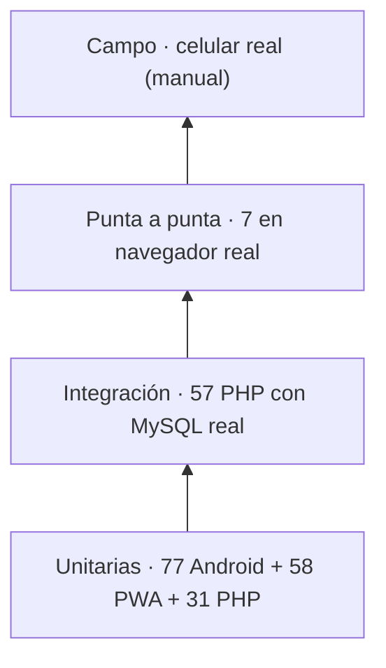

# Pruebas

Inventario de las pruebas automáticas del sistema, qué cubre cada una y cómo correrlas.

**Última ejecución completa:** 9 de octubre de 2026 · **230 pruebas, 0 fallos**.

| Suite | Pruebas | Herramienta | Necesita |
|---|---:|---|---|
| Android (unitarias JVM) | 77 | JUnit 4 + MockK | JDK 17 (Gradle lo descarga) |
| PWA (unitarias, paridad y contraste) | 58 | `node --test` | Node 20 o superior |
| API y panel (integración + unitarias) | 88 | PHPUnit 11 | PHP 8.2 con `pdo_mysql` y un MySQL |
| Punta a punta | 7 | `node --test` + Chrome/Edge | Node 22, PHP, MySQL y Chrome o Edge |
| **Total** | **230** | | |

Además corren en cada cambio: **PHPStan nivel 8** (0 errores), **Android Lint** (0 errores), la verificación del caché offline de la PWA y la de la paleta de diseño.

---

## Cómo correrlas

```bash
# Android: pruebas, lint y APK
./gradlew testDebugUnitTest lintDebug assembleDebug

# PWA (el huso importa: ver más abajo)
TZ=America/Bogota node --test pwa/tests/*.test.mjs
TZ=Asia/Tokyo     node --test pwa/tests/*.test.mjs
node scripts/check-pwa-assets.mjs     # todo lo que usa la app está en la caché offline
node scripts/tokens.mjs --verificar   # la paleta coincide con design/tokens.json

# API y panel (crea y borra su propia base, colo_pruebas)
composer install
vendor/bin/phpunit
vendor/bin/phpstan analyse

# Punta a punta (crea y borra su propia base, colo_e2e)
node --test tests/e2e/e2e.test.mjs
CAPTURAS=docs/capturas node --test tests/e2e/e2e.test.mjs   # además guarda capturas
```

Las pruebas de PHP y las de punta a punta leen la conexión de `PRUEBAS_DB_HOST`, `PRUEBAS_DB_USER` y `PRUEBAS_DB_PASS` (por defecto `127.0.0.1`, `root` y sin clave, como XAMPP). **Nunca tocan la base real**: crean una desechable y la borran al terminar. El MySQL corre en modo estricto, igual que producción, para que un dato que no cabe falle en vez de recortarse en silencio.

Las de punta a punta buscan Chrome o Edge en las rutas habituales; si está en otro lugar, `NAVEGADOR=/ruta/al/ejecutable`.

---

## Pirámide



---

## Android (`app/src/test`)

| Clase | Pruebas | Qué cubre |
|---|---:|---|
| `SyncRepositoryImplTest` | 23 | Envío por lotes de 100, confirmación parcial, rechazos terminales, descarga paginada con cursor, fallos de red |
| `AuthRepositoryImplTest` | 10 | Inicio de sesión con y sin red, credenciales guardadas, cierre de sesión |
| `ValidacionesTest` | 10 | Formato del documento por tipo, filtro de lo que se escribe, nombres, teléfono, textos libres, fecha |
| `DecisionMezclaTest` | 6 | Qué conservar al descargar; nunca se pisa un cambio sin enviar |
| `GuardarPersonaUseCaseTest` | 6 | Reglas de negocio al guardar |
| `ListaPersonasViewModelTest` | 6 | Estado de la lista y marca de pendiente |
| `GuardarRegistroCompletoUseCaseTest` | 5 | Persona + encuesta + cola en una sola transacción |
| `RegistrarEncuestaUseCaseTest` | 4 | Encuesta con autor y dispositivo |
| `SincronizarPendientesUseCaseTest` | 4 | Manejo de errores al sincronizar |
| `EliminarPersonaUseCaseTest` | 3 | Borrado suave |

La prueba de migraciones de Room (`MigracionesRoomTest`, en `androidTest`) necesita un teléfono o emulador: `./gradlew connectedDebugAndroidTest`. Ver [PRUEBAS-DE-CAMPO.md](PRUEBAS-DE-CAMPO.md).

## PWA (`pwa/tests`)

| Archivo | Pruebas | Qué cubre |
|---|---:|---|
| `utils.test.mjs` | 11 | Fechas: la de nacimiento no se corre un día en ningún huso horario |
| `validacion.test.mjs` | 11 | Reglas por campo y el filtro de lo que se escribe (`limpiarCampo`) |
| `mezcla.test.mjs` | 8 | `decidirMezcla`: los mismos casos que `DecisionMezclaTest.kt` |
| `session.test.mjs` | 8 | Vigencia del token y almacenamiento de la sesión |
| `reparto.test.mjs` | 7 | Qué queda enviado, pendiente o rechazado tras un envío parcial |
| `api.test.mjs` | 5 | Cliente HTTP: token, errores y sesión vencida |
| `paridad.test.mjs` | 4 | **Las reglas de validación son idénticas** en la PWA, el servidor y Android |
| `contraste.test.mjs` | 4 | **Contraste WCAG AA** de cada combinación de texto sobre fondo, en modo claro y oscuro |

Se corren en dos husos horarios (`America/Bogota`, desfase negativo, y `Asia/Tokyo`, positivo) porque el fallo que motivó las pruebas de fecha —la fecha de nacimiento corriéndose un día en cada edición— solo aparecía con desfase negativo.

## API y panel (`tests/php`)

| Archivo | Pruebas | Tipo | Qué cubre |
|---|---:|---|---|
| `ValidacionTest` | 31 | Unitaria | Cada regla de `validacion.php` con casos límite: documentos por tipo, nombres, teléfono, textos libres, estrato, correo, fecha |
| `PanelAdminTest` | 19 | Integración | Acceso, bloqueo por intentos, sesión revalidada, búsqueda, paginación, borrar y deshacer, CSV seguro, cuentas y último administrador |
| `SincronizacionTest` | 21 | Integración | Token, lote válido, cursor compuesto, lote de más de 500, rechazo por fila (10 casos de datos inválidos), registro de rechazos y celulares, reloj adelantado, Last-Write-Wins, salud |
| `PanelFuncionesTest` | 13 | Integración | Ficha, edición con las reglas de la sincronización, filtros, CSV filtrado, sesiones de celulares, desbloqueo, monitor, auditoría, CSP |
| `AlcanceTest` | 4 | Integración | Descarga limitada a los municipios de cada encuestador |

Las de integración levantan el servidor embebido de PHP contra una base desechable y hablan con él por HTTP, como lo haría un celular o un navegador.

## Punta a punta (`tests/e2e`)

Un navegador real (Chrome o Edge, sin ventana) recorre lo que hace una persona, en orden:

| # | Prueba | Qué comprueba |
|---|---|---|
| 1 | Arranque del panel | La contraseña de arranque entra, crea el primer administrador y deja de valer |
| 2 | Cuentas | El administrador crea un encuestador |
| 3 | Clave equivocada | No entra al panel |
| 4 | Login en la app | El encuestador entra y ve «Hola, Jairo» |
| 5 | Formulario | Lo que no corresponde no se puede escribir (`sdscf1ds5ds1c` → `151`, `584Jairo` → `Jairo`) y cada error se explica en su campo |
| 6 | Sin señal | Registra a una persona sin red: queda **Pendiente**; al volver la señal pasa sola a **Enviada** |
| 7 | De vuelta en el panel | La persona y el celular aparecen; ninguna página lanzó errores de JavaScript |

El control del navegador está en `tests/e2e/navegador.mjs` (protocolo DevTools con el `WebSocket` nativo de Node 22), sin Playwright ni Puppeteer. Con `CAPTURAS=<carpeta>` guarda una imagen de cada pantalla; las de [`docs/capturas/`](capturas/) salieron de ahí.

---

## Integración continua

`.github/workflows/ci.yml` corre todo lo anterior en cada push y pull request a `main`, en cuatro trabajos: **android**, **php**, **pwa** y **e2e**. El trabajo de punta a punta publica las capturas como artefacto.

Además hay **guardas de regresión**: comprobaciones que fallan si reaparece un fallo ya corregido (CORS permisivo, endpoints sin token, borrado real en vez de suave, lote abortado por una fila, panel sin límite de intentos…). La lista completa está en el [README](../README.md#integración-continua).

---

## Lo que las pruebas automáticas no cubren

| Qué | Por qué | Dónde se prueba |
|---|---|---|
| WorkManager y el ahorro de batería de cada fabricante | Solo existe en un teléfono real | [PRUEBAS-DE-CAMPO.md](PRUEBAS-DE-CAMPO.md) |
| Migraciones de Room sobre datos reales | Necesita un dispositivo | `connectedDebugAndroidTest` |
| Pantallas Compose | No hay pruebas instrumentadas de interfaz (HU-35) | Manual |
| Safari en iPhone | Sin sincronización en segundo plano en iOS | Manual |
